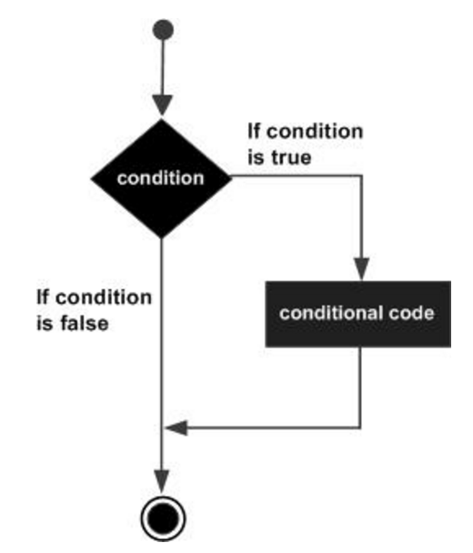

# Python Data Types and Operators
* Common Data Types 
* Simple Operators in Python
* Assignment Operators
* Scalar Data Types 
* Declaring Variables
    * Variable Naming Syntax
* Logic Operators	
* Control Flow
* Homework


<br><br><br><br><br><br><br><br><br>


----------------------------------------------------------------
# Numeric Data Types 
* A data type can be thought of as a form in which a piece of data can exist
    * `int`   :  whole numbers
    * `float` :  decimal numbers
    * `bool`  :  `True` or `False`
* The `type()` function will tell you the data type:

```python
print(type(34)) # --> <class 'int'>
print(type(72.935)) # --> <class 'float'>
print(type(True)) # --> <class 'bool'>
```

<br><br><br><br><br><br><br><br><br>


----------------------------------------------------------------
# Numeric Type Encoding
* `int` and `float` datatypes are encoded differently, but are able to share operators in Python. 
    * Notice the values are considered equivalent, while the type of each data is different:

```python
print(1.0 == 1) # --> True
print(type(1.0) == type(1)) # --> False
```

<br><br><br><br><br><br><br><br><br>


----------------------------------------------------------------
# Python is a “duck-typed” language
* _"If it walks like a duck, and quacks like a duck, then it must be a duck."_
* The data type is automatically inferred
* Gives ability to share operations between data type through type inference:

```python
print(type(1)) # --> <class 'int'>
print(type(1.3)) # --> <class 'float'>
print(type(1 == 1.0)) # --> True
print(type(1 == 1.9)) # --> False> 
```

<br><br><br><br><br><br><br><br><br>


----------------------------------------------------------------
# Simple Operators in Python
* Basic Arithmetic Operators: `+`, `-`, `*`, `/`
* Floor Division: `//`
* Modulo: `%`
* Order of Operations: PEMDAS
* Exponentiate: `**`
* Casting: `int(x)`, `float(x)`


<br><br><br><br><br><br><br><br><br>


----------------------------------------------------------------
# Basic Arithmetic Operators
The basic arithmetic operators are intuitive and follow basic PEMDAS (Parentheses, Exponents, Multiplication/Division, Addition/Subtraction)

```python
print(2**2)             # --> 4
print(2 * 2)            # --> 4
print(2 / 2)            # --> 1.0
print(2 + 2)            # --> 4
print(2 - 2)            # --> 0
print((2 + 2)**(3 - 2)) # --> 4
```


<br><br><br><br><br><br><br><br><br>


----------------------------------------------------------------
# BREAKOUT (2 minutes)
* print the result of multiplying by 7 the addition of 6 and 3
* print the product of 7 times 6, squared, with 23 subtracted from the result
* print the division of the result of 4 minus 2 times 2 into twenty


<br><br><br><br><br><br><br><br><br>


----------------------------------------------------------------
# BREAKOUT Solution:
* print the result of multiplying by 7 the addition of 6 and 3

```python
print(7 * (6 + 3)) # --> 63
```

* print the product of 7 times 6, squared, with 23 subtracted from the result

```python
print((7 * 6)**2 - 23)) # --> 1741
```

* print the division of the result of 4 minus 2 times 2 into twenty

```python
print((20 / (4 - 2 * 2)) # --> Will throw an error in this interpretation
# or
print((4 - 2) * (20 / 2)) # --> 20
```


<br><br><br><br><br><br><br><br><br>


----------------------------------------------------------------
# Floor Division
`//`
* Truncates anything after the decimal,
    * gives an int if both data types are int
* `x // y`: Returns the quotient of x divided by y

```python
print(20 // 4)     # --> 5
print(100 // 102)  # --> 0
print(27 // 3)     # --> 9
print(72.6 // 3.3) # --> 21.0
print(72 // 3.3)   # --> 21.0
print(72.6 // 3)   # --> 24.0
```


<br><br><br><br><br><br><br><br><br>


----------------------------------------------------------------
# Modulo
`%`
* Returns the remainder after dividing y into x
* Wildly helpful, as it turns out
    * can check even-ness or odd-ness using `num % 2`
    * can check divisibility

```python
if num % 2 == 0: print('num is even')
if num % 2 == 1: print('num is odd')
if num % 4 == 0: print('num is divisible by 4')

print(21 % 4) # --> 1
print(20 % 4) # --> 0
print(5 % 20) # --> 5
print(6 % 20) # --> 6
```


<br><br><br><br><br><br><br><br><br>


----------------------------------------------------------------
# Modulo with `float` values
* _Hand-wavey_: Avoid this unless you are clear on what you are doing
* Precision of the modulo operation is relative to the depth of the float
* Note the precision error!

```python
print(72.6 % 3.3)   # -> 3.299999999999998
print(72.6 % 3.33)  # -> 2.669999999999993
print(72 % 3.3)     # -> 2.7000000000000037
print(72.6 % 3)     # -> 0.5999999999999943

```


<br><br><br><br><br><br><br><br><br>


----------------------------------------------------------------
# Negative Modulo
* Negative modulo can be easily confusing. Avoid it unless it is key and you have a solid understanding of why you’re using it.

```python
print(21 % -5)  # -> -4
print(-21 % 5)  # ->  4
print(5 % -2)   # -> -1
print(-5 % 2)   # ->  1
```


<br><br><br><br><br><br><br><br><br>


----------------------------------------------------------------
# BREAKOUT (3 minutes)
1. If 3 letter carriers must deliver the same exact number of letters, and there are 299 letters, how many letters will not be delivered? Write a Python expression that answers this question.

2. If you have 5 bank tellers and 28 people waiting to be served, what is the least number of people who will not be served if it takes exactly 4 minutes to serve each person and the bank MUST close in 20 minutes? Write a Python expression that answers this question.


<br><br><br><br><br><br><br><br><br>


----------------------------------------------------------------
# BREAKOUT SOLUTION Part 1
1. If 3 letter carriers must deliver the same exact number of letters, and there are 299 letters, how many letters will not be delivered? Write a Python expression that answers this question.

```python
print(299 % 3) # --> 2
```


<br><br><br><br><br><br><br><br><br>


----------------------------------------------------------------
# BREAKOUT SOLUTION Part 2
2. If you have 5 bank tellers and 28 people waiting to be served, what is the least number of people who will not be served if it takes exactly 4 minutes to serve each person and the bank MUST close in 20 minutes? Write a Python expression that answers this question.

```python
print(28 - (20//4 * 5)) # --> 3
```


<br><br><br><br><br><br><br><br><br>


----------------------------------------------------------------
# REVIEW BREAKOUT  
* What are the two types of comments?
* What does the `type()` function do?
* What are some differences between the `int` and `float` types?


<br><br><br><br><br><br><br><br><br>


----------------------------------------------------------------
# REVIEW BREAKOUT Solution
* What are the two types of comments?
    * Single-line comments: `# this is a single line comment`
    * Multi-line comments:

```python
'''
This is a 
multi-line
comment
'''
```

* What does the `type()` function do?
    * Returns the data type of an object
* What are some differences between the `int` and `float` types?
    * An `int` is a whole number, a `float` is a decimal number
    * They are encoded differently in memory


<br><br><br><br><br><br><br><br><br>


----------------------------------------------------------------
# Casting
* Casting: `int(x)` or `float(x)`
    * _Convert a value to a different data type

```python
print(4 / 3)       # --> 1.3333333333333333
print(int(4 / 3))  # --> 1
print(float(7))    # --> 7.0
print(float(0))    # --> 0.0
```


<br><br><br><br><br><br><br><br><br>


----------------------------------------------------------------
# Assignment Operator 
* ex `x = 4`
* Variable Assignment: giving a name through which a value can be referred
* Operations on a variable will be determined by the data type of the value stored.
* Helps us keep track of values that change or values that are inputted 


<br><br><br><br><br><br><br><br><br>


----------------------------------------------------------------
# Incrementation Operators 
* Operations that modify the current value stored in a variable 
* `+=`, `-=`, `*=`, `/=`, etc. 
* Modifying the value referred to by a scalar type variable value will change the location in memory. Test this using the `id()` function

```python
x = 4
print(id(x))

x -= 2
print(id(x))
```


<br><br><br><br><br><br><br><br><br>


----------------------------------------------------------------
# What is a scalar type? 
* A scalar type holds one single value
* So far, we’ve mostly dealt with scalar types: `int`, `float`, `bool`
* Other scalar types are `string`, `None`, `complex`, `byte`


<br><br><br><br><br><br><br><br><br>


----------------------------------------------------------------
# Integers
* Integers are whole number values
* Can cast scalar data types to an integer using `int()`
* Using `int()` on a `float` always rounds down to the nearest integer


<br><br><br><br><br><br><br><br><br>


----------------------------------------------------------------
# Floats
* a `float` can be thought of as **continuous** while an `int` can be thought of as **discrete**
* Sometimes, we will consider two `float` values to be essentially equal if the difference is below some threshold.
* **Underflow** occurs when trying to represent a number that is smaller than the computer can represent in binary.
    * Can lead to unexpected behavior


<br><br><br><br><br><br><br><br><br>


----------------------------------------------------------------
# Booleans
* `True` or `False`
* Can be `1` or `0` when cast to a numeric type
* Non-zero and non-empty values return as `True`
* `not` negates a boolean
* Result of comparison operators is a `bool`


<br><br><br><br><br><br><br><br><br>


----------------------------------------------------------------
# Strings
* A `string` is an object that acts as a sequence of characters
* Declare a `string` using quotes 
* Can **concatenate** a `string` with another `string` using the `+` operator
* Note we will talk more about the `string` type in a later lecture


<br><br><br><br><br><br><br><br><br>


----------------------------------------------------------------
# `None` Type 
* `None` is not the same as `0`.
* Rather, `None` is the absence of a value
* **Functions without an explicit `return` will `return` `None`**


<br><br><br><br><br><br><br><br><br>


----------------------------------------------------------------
# BREAKOUT (2 minutes)
* What is the result of calculating `1/10**1000000`? Explain this result
* What is the result of `bool(‘’)`?
* What is the result of `bool(‘’ + ‘Hi’)`?


<br><br><br><br><br><br><br><br><br>


----------------------------------------------------------------
# BREAKOUT Solution
* What is the result of calculating `1/10**1000000`? Explain this result
    * `0.0`
* What is the result of `bool(‘’)`?
    * `False`
* What is the result of `bool(‘’ + ‘Hi’)`?
    * `True`


<br><br><br><br><br><br><br><br><br>


----------------------------------------------------------------
# Variables 
* You can think of variable assignment as giving a name to something so that it can be accessed later by different parts of your program. 
    * You can use a variable to store any data type 
    * Important for **reusability**


<br><br><br><br><br><br><br><br><br>


----------------------------------------------------------------
# Declaring Variables  
* Variables are assigned using the `=` operator. 
    * variable = value
* Need to print to see the result of assigning a variable. 
* Can assign two or more variables on the same line. 
    * `x, y = 1, 2` 


<br><br><br><br><br><br><br><br><br>


----------------------------------------------------------------
# Give it a good name
* You should strive to give your variables well-defined, succinct names
* Variable naming conventions are covered in [PEP 8](https://www.python.org/dev/peps/pep-0008/).
* Use **snake case** to name variables:
    * Replace spaces with _ 
    * `this_is_a_variable = 8`
* There are some reserved words that can’t be used as variable names. 
    * [Python reserved words list](https://docs.python.org/3/reference/lexical_analysis.html#identifiers) 


<br><br><br><br><br><br><br><br><br>


----------------------------------------------------------------
# Boolean Operators 

| Operator              | Meaning                 |
| ----------------------| ----------------------- |
| <center>`>`</center>  | Greater Than            |
| <center>`>=`</center> | Greater Than or Equal   |
| <center>`<`</center>  | Less Than               |
| <center>`<=`</center> | Less Than or Equal      |
| <center>`==`</center> | Equals or Is Equivalent |
| <center>`!=`</center> | Does not Equal          | 

```python
print(5 > 4)   # --> True
print(5 >= 6)  # --> False
print(5 < 4)   # --> False
print(5 <= 6)  # --> True
print(5 == 6)  # --> False
print(5 != 6)  #--> True
```


<br><br><br><br><br><br><br><br><br>


----------------------------------------------------------------
# Logical Operators
* Operator Precedence: `not`, `and`, `or`


```python
print(not True)       #--> False
print(not False)      #--> True
print(True and True)  #--> True
print(True and False) #--> False
print(True or False)  #--> True
```


<br><br><br><br><br><br><br><br><br>


----------------------------------------------------------------
# BREAKOUT (2 mins)
What is the result of the following boolean expression?

```python
(not (not (True or False) and (True and True))) and True or True
```


<br><br><br><br><br><br><br><br><br>


---------------------------------------------------------------
# BREAKOUT Solution

What is the result of the following boolean expression?
* note that the `or True` on the end will evaluate the whole thing as `True`. We'll simplify the whole thing anyway

```python
(not (not (True or False) and (True and True))) and True or True
#          --simplify---
(not (not True and (True and True))) and True or True
#     --------
(not (False and (True and True))) and True or True
#                -------------
(not (False and True)) and True or True
#     --------------
(not False and True or True
#--------- 
True and True or True
#------------
True or True
#----------
True
```


<br><br><br><br><br><br><br><br><br>


---------------------------------------------------------------
# Bitwise Operators: `~`, `&`, `|`
* `~`, `&`, `|` are the matching bitwise operators for `not`, `and`, and `or`
* Don’t use these or worry about them for now
* They may not behave exactly as you expect


<br><br><br><br><br><br><br><br><br>


---------------------------------------------------------------
# Exclusive or (XOR)
* `^` is the bitwise operator for **exclusive or**
* For now, think of this as asking the question **“are these two things different?”**


<br><br><br><br><br><br><br><br><br>


---------------------------------------------------------------
# Order of Logical Operators 


|  Order of Operations    |
|-------------------------|
| <center> ~ </center>    |
| <center> & </center>    |
| <center> ^ </center>    |
| <center> | </center>    |
| <center> not </center>  |
| <center> and </center>  |
| <center> or </center>   |


<br><br><br><br><br><br><br><br><br>


---------------------------------------------------------------
# BREAKOUT (3 minutes) 
### What do each of these return?
* `not 7 > 2`
* `3 >= 2 or 5 < 1`
* `not 8 `
* `bool(‘’) and 5 != 3`
* `bool(‘’) and 5 != 5`


<br><br><br><br><br><br><br><br><br>


---------------------------------------------------------------
# BREAKOUT Solution
### What do each of these return?
* `not 7 > 2`
    * `False`
* `3 >= 2 or 5 < 1`
    * `True`
* `not 8 `
    * `False`
* `bool(‘’) and 5 != 3`
    * `False`
* `bool(‘’) and 5 != 5`
    * `False`


<br><br><br><br><br><br><br><br><br>

---------------------------------------------------------------
# Control Flow: if/else




<br><br><br><br><br><br><br><br><br>

---------------------------------------------------------------
# if
* We use if statements if we want to evaluate code only under a certain condition
* Only when the statement following the if keyword evaluates to True will Python run the code in the body of the if block
* Syntax: 

```python
if some_condition:
    # execute this code
else:
    # execute this code
```

<br><br><br><br><br><br><br><br><br>

---------------------------------------------------------------
# if/elif/else
* Often, we will want to execute some other code if the condition in the if statement is not met.
    * Use an if-else statement
* What if we want to check multiple conditions?
    * Use if-elif-else
    * You can use multiple elif statements 
    * Order matters!

<br><br><br><br><br><br><br><br><br>

---------------------------------------------------------------
# if/elif/else syntax

```python
if some_condition:
    # execute this code
elif another_condition:
    # execute other code
elif yet_another_condition:
    # execute this code
else:
    execute some other code
```

<br><br><br><br><br><br><br><br><br>

---------------------------------------------------------------
# if/elif/else
* We can incorporate comparison operators and logical operators into our if statements

```python
x = 7
y = False

if x < 10 and not y:
    print('all is well')
elif x > 3 and y:
    print('danger')
else:
    print('nothing matters')
```

will output

```python
# --> all is well
```

<br><br><br><br><br><br><br><br><br>

---------------------------------------------------------------
# BREAKOUT (5 minutes)

* Write a code snippet that checks two numbers, `x` and `y`:
    * Check if the sum of two numbers is greater than both numbers
        * If it is, print `"Both numbers are positive"`
    * Check if the sum is equal to either number
        * If it is, print `"At least one number is zero"`
    * Otherwise, print `"At least one number is negative"`

<br><br><br><br><br><br><br><br><br>

---------------------------------------------------------------
# BREAKOUT solution

```python
if x + y == x or x + y == y:
    print('At least one number is zero')
elif x + y > x and x + y > y:
    print('Both numbers are positive')
else:
    print('At least one number is negative')
```


<br><br><br><br><br><br><br><br><br>

---------------------------------------------------------------
# Homework

* Complete the Day 1 Homework if not completed
* Complete all Challenges in these Learn Sections
    * [Variables](https://learn-2.galvanize.com/content_link/github/gSchool/dsi-prep-module-introPython/03_Variables/00_unit_overview.md)
	* [Scalar Types](https://learn-2.galvanize.com/content_link/github/gSchool/dsi-prep-module-introPython/04_Scalar_Types/00_unit_overview.md)
	* [Basic Operators](https://learn-2.galvanize.com/content_link/github/gSchool/dsi-prep-module-introPython/05_Basic_Operators/00_unit_overview.md)
	* [Control Flow](https://learn-2.galvanize.com/content_link/github/gSchool/dsi-prep-module-introPython/06_Control_Flow/00_unit_overview.md)