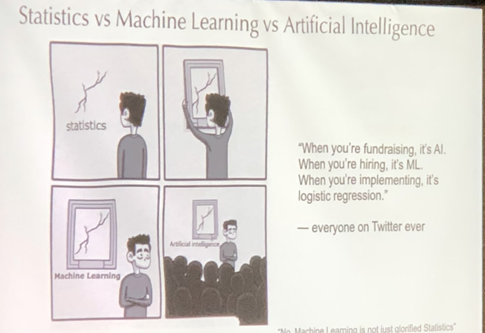

* Add [this Chrome Extension](https://chrome.google.com/webstore/detail/mathjax-plugin-for-github/ioemnmodlmafdkllaclgeombjnmnbima) so you can see math equations rendered in GitHub


# Statistics: Measures of Centrality
* Why Statistics?
* Measures of Centrality

<br><br><br><br><br><br><br><br><br>

---------------------------------------------------------------
# Why are probability and statistics important?
* Data Science is an extension of statistics, just as it is an abstraction of all the Sciences
* **All** of our models and practices in data science are either rooted in or validated by probability and statistics
    * Experimental design and reporting are performed through the lens of statistics
    * Linear Regression, Logistic Regression
    * Sampling/Resampling Methods (Bootstrap)
    * confidence intervals
    * expectation, deviance, etc

<br><br><br><br><br><br><br><br><br>

---------------------------------------------------------------
# Statistics vs Machine Learning vs Artificial Intelligence




<br><br><br><br><br><br><br><br><br>

---------------------------------------------------------------
# Basic Summary Statistics Overview
* Measures of Central Tendency
    * Mean
    * Median
    * Mode
* Measures of variance or “spread”
    * Variance
    * Standard Deviation


<br><br><br><br><br><br><br><br><br>

---------------------------------------------------------------
# Mean
* sum of the numeric elements, divided by the number of elements, expressed as:

$$
\frac{1}{n} \sum_{i=1}^n a_i
$$

|Symbol                 |           Meaning               |
|-------------------------------|---------------------------------|
| <center>$\mu$</center>        | lowercase greek mu refers to **population mean**    |
| <center>$\overline x$</center>| "x-bar" refers to the **sample mean** |
| <center>$\overline X$</center>| capital "X-bar" refers to the sample mean where $\bold X$ is a random variable |


<br><br><br><br><br><br><br><br><br>

---------------------------------------------------------------
# Trimmed Mean
* Can be used to combat large devations and outliers
* “trim” some percent off of  max and min of data list:
* Advantage - can help combat outliers that might influence our mean
* Disadvantage - we are removing portions of our data which might be very important


<br><br><br><br><br><br><br><br><br>

---------------------------------------------------------------
# BREAKOUT (4 minutes)
*  Code the `mean()` function
* BONUS: Include a `trim` parameter that removes the greatest and least `n` values

* Test with this data:

```python
a = [1, 5, 7, 10, 15, 23, 35, 67, 220, 2000]
```

<br><br><br><br><br><br><br><br><br>

---------------------------------------------------------------
# BREAKOUT SOLUTION

```python
def mean(lst, trim_by=0):
    lst_ = lst.copy()

    if trim_by > 0:
        
        lst_ = sorted(lst_)[trim_by:-trim_by]

    return sum(lst_) / len(lst_)
```


<br><br><br><br><br><br><br><br><br>

---------------------------------------------------------------
# BREAKOUT (4 minutes)
* An article published in the journal, Indoor Air, considered two different air samples to test for endotoxin concentrations, the first in urban households, and the second in farmhouses.
    * Urban: 6.0, 5.0, 11.0, 33.0, 4.0, 5.0, 80.0, 18.0, 35.0, 17.0, 23.0
    * Farmhouse: 4.0, 14.0, 11.0, 9.0, 9.0, 8.0, 4.0, 20.0, 5.0, 8.9, 21.0, 9.2, 3.0, 2.0, 0.3
* A. Determine the sample mean for each group.

* B. Determine the trimmed mean for each group by trimming the smallest and largest value from each group.


<br><br><br><br><br><br><br><br><br>

---------------------------------------------------------------
# BREAKOUT SOLUTION

```python
'''
A. Determine the sample mean for each group.
'''
urban = [6.0, 5.0, 11.0, 33.0, 4.0, 5.0, 80.0, 18.0, 35.0, 17.0, 23.0]
farmhouse = [4.0, 14.0, 11.0, 9.0, 9.0, 8.0, 4.0, 20.0, 5.0, 8.9, 21.0, 9.2, 3.0, 2.0, 0.3]

print(f'Sample Mean Urban: {round(mean(urban), 1)}')
print(f'Sample Mean Farmhouse: {round(mean(farmhouse), 1)}')

'''
B. Determine the trimmed mean for each group by trimming the smallest and largest value 
from each group.
'''
print(f'Sample Trimmed Mean Urban: {round(mean(urban, trim_by=1), 1)}')
print(f'Sample Trimmed Mean Farmhouse: {round(mean(farmhouse, trim_by=1), 1)}')

```