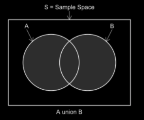
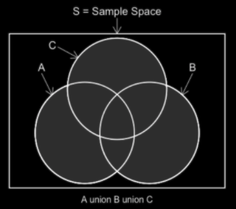
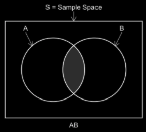
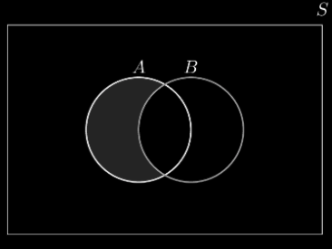
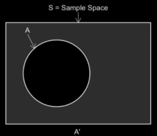

# Set Theory
* Random Experiment, Sample Space, Events
* Set Operations
    * Unions
    * Intersections
    * Complement


<br><br><br><br><br><br><br><br><br>

---------------------------------------------------------------
# Random Experiments
An experiment or process for which the outcome is unknown
* Examples: 
    * Flipping a coin
    * Rolling a die
    * Inspector finds a manufacturing flaw on a given part
* If a specific outcome is guaranteed, we call it certain
* If a specific outcome can not happen, we call it impossible
* A certain or impossible outcome indicates that we may not be considering a random experiment


<br><br><br><br><br><br><br><br><br>

---------------------------------------------------------------
# Definition of a Set
* In mathematics, a set is a well-defined collection of objects
    * A set is also an object in itself
* Sets must be comprised of unique objects: **NO DUPLICATES**
* If the outcome of a random experiment is unknown, and all of the possible outcomes are predictable in nature, this set of outcomes is known as the **Sample Space**, notated with a capital $S$, or as the “Universal Set”,  denoted $U$, or $\Omega$ (capital omega)


<br><br><br><br><br><br><br><br><br>

---------------------------------------------------------------
# ASIDE: The list/set trick for deduping
* The `set` datatype does not allow duplicates and thus provides a simple way to remove duplicates from a list
* Might not maintain order from the original `list`


```python
lst = ['dog', 'cat', 'cat', 'bird']

lst = list(set(lst))
```

<br><br><br><br><br><br><br><br><br>

---------------------------------------------------------------
# BREAKOUT (4 mins)
Write a function called `dedupe_in_order` that takes a `list` that may contain duplicates as input and returns a list without duplicates.
* Maintain the order of the elements in the list (do not use the `list/set` trick)


<br><br><br><br><br><br><br><br><br>

---------------------------------------------------------------
# BREAKOUT SOLUTION

```python
def dedupe_in_order(lst):
    deduped = []

    for element in lst:
        if element not in deduped:
            deduped.append(element)

    return deduped
```


<br><br><br><br><br><br><br><br><br>

---------------------------------------------------------------
# Sample Space
* Each possible outcome of a random experiment is known as a **sample point**
    * Example: The set of possible sample points for the rolling of a fair six-sided die:
        * $S$ = Sample Space = { ⚀, ⚁, ⚂, ⚃, ⚄, ⚅ } 

NOTE: the word **pip** refers to a single dot on a die, thus ⚄ has 5 pips.


<br><br><br><br><br><br><br><br><br>

---------------------------------------------------------------
# Subsets aka Events
In the terms of probability theory, **subsets** of the sample space are collections of sample points which are referred to as **Events**.

$S$ = Sample Space = { ⚀, ⚁, ⚂, ⚃, ⚄, ⚅ }

Example: For the sample space $S$ here are some examples:
* $A$ = The event in which the resulting number of pips showing is greater than 3
* $B$ = The event in which the resulting number of pips showing is even
* $C$ = The event in which the resulting number of pips showing is exactly 3

NOTE: Events are commonly represented by capital letters, starting at the beginning of the alphabet.


<br><br><br><br><br><br><br><br><br>

---------------------------------------------------------------
# Venn Diagrams
Venn Diagrams are often used to visualize sets, set operations, and probabilities.

<center>



</center>


<br><br><br><br><br><br><br><br><br>

---------------------------------------------------------------
# Set Operations
We will explore the following set operations not using the `set` datatype. Instead, we will use lists and think about how to perform these as simple procedures.

* Union
* Intersection
* Set Difference
* Complement


<br><br><br><br><br><br><br><br><br>

---------------------------------------------------------------
# Set Union
The union of two sets is a new set that contains all of the elements that are in at least one of the two sets.


Common Notation for the union of events A and B: 
A ∪ B

There is a distinct relationship between the set theory definition of union, and the logical operator OR.


<br><br><br><br><br><br><br><br><br>

---------------------------------------------------------------
# Set Union for more than 2 events
The union can be extrapolated to more than two events



Common Notation multiple events: 
A ∪ B ∪ C
A ∪ B ∪ C ∪ D

NOTE: The order of the union operation does not matter

<br><br><br><br><br><br><br><br><br>

---------------------------------------------------------------
# BREAKOUT (4 minutes)
Code the `union()` function for two lists.


<br><br><br><br><br><br><br><br><br>

---------------------------------------------------------------
# BREAKOUT SOLUTION

```python
def union(set1, set2):
    set_union = set1.copy()

    for item in set2:
        if item not in set_union:
            set_union.append(item)

    return set_union
```


<br><br><br><br><br><br><br><br><br>

---------------------------------------------------------------
# ASIDE: Star Arguments (`*args`)
* `*args` allow for an arbitrary length tuple to be passed into the function as an argument.

```python
def star_args(*args):
    print(type(args))
    for item in args:
        print(item)
    return None
```


<br><br><br><br><br><br><br><br><br>

---------------------------------------------------------------
# BREAKOUT (4 minutes)
Code the `union_mult_sets(*args)` function. This function should allow for any number of lists to be passed in and should return the Union of those lists.


<br><br><br><br><br><br><br><br><br>

---------------------------------------------------------------
# BREAKOUT SOLUTION

```python
def union_mult_sets(*mult_sets):
    set_union = []

    for lst in mult_sets:
        for item in lst:
            if item not in set_union:
                set_union.append(item)
    
    return set_union
```


<br><br><br><br><br><br><br><br><br>

---------------------------------------------------------------
# Set Intersection
The intersection of two sets is a new set that contains all of the elements that are members of both sets which comprise the intersection



Common Notation for the intersection of events A and B: 
AB or A ∩ B

There is a distinct relationship between the set theory definition of intersection, and the logical operator AND.


<br><br><br><br><br><br><br><br><br>

---------------------------------------------------------------
# BREAKOUT (3 minutes)
Code the `intersection()` function for two lists.


<br><br><br><br><br><br><br><br><br>

---------------------------------------------------------------
# BREAKOUT SOLUTION

```python
def intersection(set1, set2):
    set_intersect = []

    for item in set1:
        if item in set2:
            set_intersect.append(item)
    return set_intersect
```

<br><br><br><br><br><br><br><br><br>


---------------------------------------------------------------
# BREAKOUT (4 minutes)
Code the `intersection_mult(*args)` function for an arbitrary number of lists.


<br><br><br><br><br><br><br><br><br>

---------------------------------------------------------------
# BREAKOUT SOLUTION

```python
def intersection_mult(*args):
    set_intersect = []

    if len(args) > 1 and len(args[0]) > 0:
        for item in args[0]:
            is_member = True

            for set_ in args[1:]:
                if item not in set_:
                    is_member = False
                    break

            if is_member:
                set_intersect.append(item)

    return set_intersect
```


<br><br><br><br><br><br><br><br><br>

---------------------------------------------------------------
# Set Difference
Set Difference is anything in one set that isn’t the other.



Syntax:
A\B, A-B, A.difference(B)

Example:
A = {1, 2, 3, 4, 5}
B = {5, 6, 7, 8, 9}
A - B = {1, 2, 3, 4}
B - A = {6, 7, 8, 9}


<br><br><br><br><br><br><br><br><br>


---------------------------------------------------------------
# BREAKOUT (4 minutes)
Code the `difference()` function for two lists


<br><br><br><br><br><br><br><br><br>

---------------------------------------------------------------
# BREAKOUT SOLUTION

```python
def difference(set1, set2):
    set_difference = []

    for item in set1:
        if item not in set2:
            set_difference.append(item)
    return set_difference
```


<br><br><br><br><br><br><br><br><br>

---------------------------------------------------------------
# Complement
The complement of a set is the set which represents all members of the sample space which are not in the event.



Common Notation for the complement of events A and B: 
A’ or Ac or A0 or Ā or ¬A or ~A

There is a distinct relationship between the complement and the logical operator NOT


<br><br><br><br><br><br><br><br><br>


---------------------------------------------------------------
# BREAKOUT (4 minutes)
Code the `complement()` function. You should pass in the sample space as well as the list for which you want to find the complement, and return the sample space minus the list.


<br><br><br><br><br><br><br><br><br>

---------------------------------------------------------------
# BREAKOUT SOLUTION

```python
def complement(sample_space, set1):
    return difference(sample_space, set1)
```


<br><br><br><br><br><br><br><br><br>


---------------------------------------------------------------
# BREAKOUT (1 minute)
Which of the following would not be considered a random experiment? Why?

A. The selection of a numbered ball from a bucket of numbered balls (1-50)
B. The amount of time needed to wait for a taxi cab
C. Randomly selecting a colored marble from an urn full of numbered balls


<br><br><br><br><br><br><br><br><br>

---------------------------------------------------------------
# BREAKOUT SOLUTION

Which of the following would not be considered a random experiment? Why?
A. The selection of a numbered ball from a bucket of numbered balls (1-50)
B. The amount of time needed to wait for a taxi cab
C. Randomly selecting a colored marble from an urn full of numbered balls

**Solution**: C - Pulling a colored marble from an urn full of numbered balls, this outcome is impossible, therefore this is not considered a random experiment


<br><br><br><br><br><br><br><br><br>

---------------------------------------------------------------
# BREAKOUT (5 minutes)
1. Write out the sample space for the random experiment which is defined as sequentially completing the following steps:
* First, rolling a four-sided die
* Then, flipping a coin
* And finally, flipping the coin a second time

2. List the sample points in the following events:
A = The event in which the die roll results in exactly one pip showing
B = The event in which at least one of the coin flips results in heads

3. List the sample points which are in the Union of events A and B from above


<br><br><br><br><br><br><br><br><br>

---------------------------------------------------------------
# BREAKOUT SOLUTION

##### 1. Write out the sample space for the random experiment which is defined as sequentially completing the following steps:
* First, rolling a four-sided die
* Then, flipping a coin
* And finally, flipping the coin a second time

**Solution**: S = { 1HH, 1HT, 1TH, 1TT, 2HH, 2HT, 2TH, 2TT, 3HH, 3HT, 3TH, 3TT, 4HH, 4HT, 4TH, 4TT  }

##### 2. List the sample points in the following events:
A = The event in which the die roll results in exactly one pip showing
B = The event in which at least one of the coin flips results in heads

**Solution**: 
A = { 1HH, 1HT, 1TH, 1TT }
B = { 1HH, 1HT, 1TH, 2HH, 2HT, 2TH, 3HH, 3HT, 3TH, 4HH, 4HT, 4TH }

##### 3. List the sample points which are in the Union of events A and B from above

**Solution**: A ∪ B = { 1HH, 1HT, 1TH, 1TT, 2HH, 2HT, 2TH, 3HH, 3HT, 3TH, 4HH, 4HT, 4TH }


<br><br><br><br><br><br><br><br><br>

---------------------------------------------------------------
# BREAKOUT (5 minutes)

Given the random experiment which is defined by four sequential flips of a fair coin, and the following events:
A = There are 3 or more heads
B = There are 2 or fewer tails
C = All of the coins show the same face

##### 1. List the sample points in each A, B, and C

##### 2. List the sample points in the set A~C

##### 3. List the sample points in the set ~(AC)


<br><br><br><br><br><br><br><br><br>

---------------------------------------------------------------
# BREAKOUT SOLUTION

Given the random experiment which is defined by four sequential flips of a fair coin, and the following events:
A = There are 3 or more heads
B = There are 2 or fewer tails
C = All of the coins show the same face

##### 1. List the sample points in each A, B, and C

**Solution**: 
A = { HHHT, HHTH, HTHH, THHH, HHHH } 
B = { HHHH, HHHT, HHTH, HTHH, THHH, TTHH, THTH, THHT, HTTH, HTHT, HHTT }
C = { TTTT, HHHH }


##### 2. List the sample points in the set A~C

**Solution**: A~C = { HHHT, HHTH, HTHH, THHH }


##### 3. List the sample points in the set ~(AC)

**Solution**: ~(AC) = { HHHT, HHTH, HTHH, THHH, HHTT HTTH, TTHH, THTH, THHT, HTHT, TTTH, TTHT, THTT, HTTT, TTTT }


<br><br><br><br><br><br><br><br><br>

---------------------------------------------------------------
# BREAKOUT (3 minutes)

Let our sample space be rolling two 6-sided dice.
* Event A: any roll with a sum greater than or equal to 10
* Event B: any roll with an even sum

##### What do our events A and B look like?

##### What is A - B?

##### What is B - A?


<br><br><br><br><br><br><br><br><br>

---------------------------------------------------------------
# BREAKOUT SOLUTION

Let our sample space be rolling two 6-sided dice.
* Event A: any roll with a sum greater than or equal to 10
* Event B: any roll with an even sum

##### What do our events A and B look like?

A = {46, 55, 64, 56, 65, 66}
B = {11, 22, 33, 44, 55, 66, 13, 31, 15, 51, 35, 53, 24, 42, 26, 62, 46, 64}

##### What is A - B?

A - B = {56, 65}

##### What is B - A?

B - A = {11, 22, 33, 44, 13, 31, 15, 51, 35, 53, 24, 42, 26, 62}
