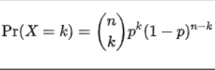

<!-- https://docs.google.com/presentation/d/1roK02HmZNqd_f3rvJkY0upEesA61fiHHZZ9Xe3TkNFs/edit#slide=id.p -->

<!-- 1 -->
# Function Practice 1!

<br><br><br><br><br><br><br><br><br>
---------------------------------------------------------------
<!-- 2 -->
## Reminder

**If you are working on the take home technical python problems for admissions know that we CANNOT help you with the python or the coding of these problems.**


<br><br><br><br><br><br><br><br><br>
---------------------------------------------------------------
<!-- 3 -->
## Function Breakout #1a

Write a function called percentile_50 that takes a list of arbitrary numbers
The function will return a dictionary
* where the keys are strings that describe the upper and lower 50th percentile (the median) as a range (see below)
* And the values are lists containing numbers from the input list that fall within the lower(inclusive) or upper(also inclusive) percentile described by the key

Ex: a list: `[1, 5, 8, 234, 64, 5, 0.1, 44, 746, 9, 10]`<br>
This should return:
`{'<=0.50': [1, 5, 8, 5, 0.1, 9], '>=0.50': [234, 64, 44, 746, 9, 10]}`

**Let’s break this down**

<br><br><br><br><br><br><br><br><br>
---------------------------------------------------------------
<!-- 4 -->
## Function Breakout #1a

Step 1: We need to identify the median (you’ve done this before)
Using our example list, how would you - in plain words - identify the median?
<br>`[1, 5, 8, 234, 64, 5, 0.1, 44, 746, 9, 10]`<br>
Alright, now recall Stats Homework #1? How would you code the median?
```python
def median(lst):
   sorted_lst = sorted(lst)
   if len(lst) % 2 != 0:
       return sorted_lst[int(len(lst) / 2 - .5)]
   else:
       return mean_of_list([sorted_lst[int(len(lst) / 2 - 1)], sorted_lst[int(len(lst) / 2)]])
```

<br><br><br><br><br><br><br><br><br>
---------------------------------------------------------------
<!-- 5 -->
## Function Breakout #1a

Step 2: Alright, now that we know how to calculate the median, what does our dictionary that we want to accumulate into look like?
<br>`d = {'<=0.50':[], '>=0.50': []} `

<br><br><br><br><br><br><br><br><br>
---------------------------------------------------------------
<!-- 6 -->
## Function Breakout #1a

Step 3: Now we need to identify how each object in the list compares to the median, so what does the bare bones of our control flow look like?
```python
med = median(lst)
d = {'<=0.50':[], '>=0.50': []}

if num >= med:
    pass
if num <= med:
    pass
```


<br><br><br><br><br><br><br><br><br>
---------------------------------------------------------------
<!-- 7 -->
## Function Breakout #1a

Step 4: Now we need to fill in our control flow with the correct accumulations into our dictionary

```python
med = median(lst)
d = {'<=0.50':[], '>=0.50': []}

if num >= med:
    d['>=0.50'].append(i)
if num <= med:
    d['<=0.50'].append(i)
```

<br><br><br><br><br><br><br><br><br>
---------------------------------------------------------------
<!-- 8 -->
## Function Breakout #1a

Step 4: Awesome!! Now put it all together in a function called `percentile_50()`

```python
def percentile_50(l):
   med = median(l)
   d = {'<=0.50':[], '>=0.50': []}
   for i in l:
       if i >= med:
           d['>=0.50'].append(i)
       if i <= med:
           d['<=0.50'].append(i)

   return d
```

<br><br><br><br><br><br><br><br><br>
---------------------------------------------------------------
<!-- 9 -->
## Function Breakout #1b
Modifying what we have built already, let’s try this again, but instead of the 50th percentile, let’s cut our data into quartiles and do the same thing!

Let’s make a function that takes in a list of random numbers (Could be floats or ints) and returns a dictionary which identifies where the numbers appear in terms of quartiles. Assume each quartile mark includes the lower end of the range and goes up to but does not include the upper end of the range.


<br><br><br><br><br><br><br><br><br>
---------------------------------------------------------------
<!-- 10 -->
## Function Breakout #1b
Step 1: We need to identify the quartiles
Using our example list, how would you - in plain words - identify the quartiles?
`[1, 5, 8, 234, 64, 5, 0.1, 44, 746, 9, 10]`
Alright, now recall our median code and our code from breakout 1a? How can that be used to identify the quartiles?
```python
list_median = median(lst)
percentile_50_d = percentile_50(lst)
list_25th = median(percentile_50_d['<=0.50'])
list_75th = median(percentile_50_d['>=0.50'])
```


<br><br><br><br><br><br><br><br><br>
---------------------------------------------------------------
<!-- 11 -->
## Function Breakout #1b
Step 2: What does our dictionary look like that we need to accumulate into?

`d = {'<0.25':[], '<0.50': [], '<0.75':[], '<=1.0':[]}`

<br><br><br><br><br><br><br><br><br>
---------------------------------------------------------------
<!-- 12 -->
## Function Breakout #1b
Step 3: Now we need to identify how each object in the list compares to the median, so what does the bare bones of our control flow look like?
```python
d = {'<0.25':[], '<0.50': [], '<0.75':[], '<=1.0':[]}
if i < list_25th:
    pass
elif i < list_median:
    pass
elif i < list_75th:
    pass
else:
    pass
```

<br><br><br><br><br><br><br><br><br>
---------------------------------------------------------------
<!-- 13 -->
## Function Breakout #1b
Step 4: Fill in the control flow to accumulate into the correct conditions
```python
d = {'<0.25':[], '<0.50': [], '<0.75':[], '<=1.0':[]}
if i < list_25th:
    d['<0.25'].append(i)
elif i < list_median:
    d['<0.50'].append(i)
elif i < list_75th:
    d['<0.75'].append(i)
else:
    d['<=1.0'].append(i)
```

<br><br><br><br><br><br><br><br><br>
---------------------------------------------------------------
<!-- 14 -->
## Function Breakout #1b
Step 5: Now let’s put it all together in a function called `quartiles()`
```python
def quartiles(l):
   l_med = median(l)
   percentile_50_d = percentile_50(l)
   l_25 = median(percentile_50_d['<=0.50'])
   l_75 = median(percentile_50_d['>=0.50'])
   d = {'<0.25':[], '<0.50': [], '<0.75':[], '<=1.0':[]}

   for i in l:
       if i < l_25:
           d['<0.25'].append(i)
       elif i < l_med:
           d['<0.50'].append(i)
       elif i < l_75:
           d['<0.75'].append(i)
       else:
           d['<=1.0'].append(i)

   return d
```

<br><br><br><br><br><br><br><br><br>
---------------------------------------------------------------
<!-- 15 -->
## Function Breakout #2
Create a function that takes in a number will flip a coin H or T and return the count of times the coin flipped heads and tails as well as a list of what the flips were.

```python
Example: returns:
{'heads': 4, 'tails':6}
['H', 'T', 'T', 'T', 'H', 'H', 'T', 'T', 'H', 'T']
```

<br><br><br><br><br><br><br><br><br>
---------------------------------------------------------------
<!-- 16 -->
## Function Breakout #2
Step 1: You can use either:
```python
random.choice()  # takes in choices and returns a choice fairly
random.randint() # returns an integer within the range given fairly
random.random()  # returns an float between 0 and 1
```
If you could choose, which one would you use and why? There is no right answer here


<br><br><br><br><br><br><br><br><br>
---------------------------------------------------------------
<!-- 17 -->
## Function Breakout #2
Step 2:
What do our accumulators look like that we will need for this function?

```python
For me, I’ll choose random.random()
d = {'heads': 0, 'tails': 0}
choice_lst = []
```

<br><br><br><br><br><br><br><br><br>
---------------------------------------------------------------
<!-- 18 -->
## Function Breakout #2
Step 3: Use our random method to get our choice

`flip = random.random()`


<br><br><br><br><br><br><br><br><br>
---------------------------------------------------------------
<!-- 19 -->
## Function Breakout #2
Step 4: Assuming a fair coin, anything greater than 0.5 will be denoted as heads and anything less than or equal to 0.5 will be denoted as tails. What does the bare bones of our control flow look like?
```python
flip = random.random()
if flip <= 0.50:
    pass
else:
    pass
```

<br><br><br><br><br><br><br><br><br>
---------------------------------------------------------------
<!-- 20 -->
## Function Breakout #2
Step 5: Fill in our control flow with the correct accumulations for a single flip.
```python
d = {'heads': 0, 'tails': 0}
choice_lst = []
flip = random.random()
if flip <= 0.50:
    d['tails'] += 1
    choice_lst.append('T')
else:
    d['heads'] += 1
    choice_lst.append('H')
```

<br><br><br><br><br><br><br><br><br>
---------------------------------------------------------------
<!-- 21 -->
## Function Breakout #2
Step 6: Now let’s put it all together in a function called `flip_coin()`
```python
def flip_coin(n):
   d = {'heads': 0, 'tails': 0}
   choice_lst = []
   for _ in range(n):
       flip = random.random()
       if flip <= 0.50:
           d['tails'] += 1
           choice_lst.append('T')
       else:
           d['heads'] += 1
           choice_lst.append('H')

   return d, choice_lst
```

<br><br><br><br><br><br><br><br><br>
---------------------------------------------------------------
<!-- 22 -->
## Function Breakout #3

Let’s create a function that will return the probability that we will get a Heads exactly k times out of n flips (this is a preview for what you will be going over tomorrow - binomial distribution PMF)


We want to represent the below equation in python, where n is the number of trials, k is the number of successes and p is the probability of a success.

<br>

<br><br><br><br><br><br><br><br><br>
---------------------------------------------------------------
<!-- 23 -->
## Function Breakout #3
Recall for Bernoulli: What is the expected value?

    We know that μ = ∑ xi * P(X = xi)

    What are our outcomes?

    Heads = success or 1
    p(1) = p(X = 1) = p
    Tails = non-success or 0
    p(0) = p(X = 0) = 1 - p

    E(X) = 0 * (1 - p) + 1 * p = p

    What is the value of p?
    p = 1/2Å


<br><br><br><br><br><br><br><br><br>
---------------------------------------------------------------
<!-- 24 -->
## Function Breakout #3
* Step 1: What is our equation? What are the parts of the equation?
<br>

* Who remembers what (n k) means? How do we code this?

* Do you recall this in one of your stats homeworks?
<br>

<br><br><br><br><br><br><br><br><br>
---------------------------------------------------------------
<!-- 25 -->
## Function Breakout #3
Step 2: How do you code for factorial?
<br>

```python
def factorial(n):
    prod = 1
    for i in range(1, n+1):
        prod *= i

    return prod
```

<br><br><br><br><br><br><br><br><br>
---------------------------------------------------------------
<!-- 26 -->
## Function Breakout #3
Step 3: How do you code for combinations?
<br>

```python
def combinations(n, k):
    return factorial(n) / (  factorial(n - k) * factorial(k)  )
```

<br><br><br><br><br><br><br><br><br>
---------------------------------------------------------------
<!-- 27 -->
## Function Breakout #3
Step 4: Based on our equation, how can you put it all together?
<br>


```python
def binomial_pmf(n, k, p=0.5):
    return combination(n, k) * (p ** k) * ((1-p)**(n-k))
```

<br><br><br><br><br><br><br><br><br>
---------------------------------------------------------------
<!-- 28 -->
## Function Breakout #3
Step 5: put it all together, let’s create a function that returns our values!
```python
def factorial(n):
   fact = 1
   for i in range(1, n + 1):
       fact *= i
   return fact

def combination(n, k):
   return int(factorial(n) / (factorial(n - k)* factorial(k)))

def binomial_pmf(n, k, p=0.5):
   return combination(n, k) * (p**k) * ((1 - p)**(n - k))
```


<br><br><br><br><br><br><br><br><br>
---------------------------------------------------------------
<!-- 29 -->
# Today’s Homework
https://colab.research.google.com/drive/1sgw4b5B32EM8phItenyPttUes8rNMzMi


<br><br><br><br><br><br><br><br><br>
---------------------------------------------------------------
