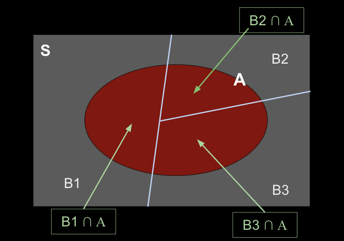

# Conditional Probability and Bayes
* Bayesian vs Frequentist Thought
* Kolmogorov's Definition for Conditional Probability
* Law of Total Probability
* Bayes Theorem
* Bayes Textbook Problems

       

----------------------------------------------------
# Bayesian vs Frequentist Thought
##### Frequentist
Statistical inference in the past century has primarily relied upon a classical, or frequentist approach, which makes inferences about populations from samples. This approach results in some explicit level of confidence via hypothesis testing and confidence intervals, using probability theory and probability distributions as the foundation to determine whether a sampling is difference by chance, or because the population being sampled is actually different than some initial hypothesized value.

##### Bayesian
ayesian Inference does not consist of a static model the way that frequentist statistics do, rather, the models take in new information, and based on that new data, the underlying probabilistic model is adjusted. This is called the posterior distribution, in the end we end up with an evolving model. Essentially, new observations allow for “updating a belief” about the phenomenon being observed.

       

----------------------------------------------------
# Conditional Probability
A conditional probability is a measure of the probability of one event occurring, given that another (different) event has occurred, or will occur.
* Implicitly, we presume, assume, assert, or see evidence that the given event has or will occur.
* This can be interpreted as limiting the sample space of the event we are measuring. 

       

----------------------------------------------------
# Visualizing Conditional Probability

$$
P(A|B) = \frac{P(A \cap B)}{P(B)} = \frac{2}{2+3} = \frac{2}{5} = 0.4
$$

       

----------------------------------------------------
# Kolmogorov's Definition
### of Conditional Probability

$$
P(A|B) = \frac{P(A \cap B)}{P(B)}
$$

       

----------------------------------------------------
# Conditional Probability Example

$$
P(A|B) = \frac{P(A \cap B)}{P(B)}
$$

A survey was given to a number of regarding their pets. 40% of respondents reported owning a dog, 45% of respondents reported owning a cat, and 25% of students responded to owning both (All students owning both were counted in all categories). 

##### What is the probability of a student owning a dog, if we know they own a cat?

1. Frame the question

$$
P(\text{cat}|\text{dog}) = ?
$$

2. Write down known info
* $P(\text{cat}) = 0.45$
* $P(\text{dog}) = 0.40$
* $P(\text{cat} \cap \text{dog}) = 0.25$

3. Apply Kolmogorov's Definition

$$
P(A|B) = \frac{P(A \cap B)}{P(B)} \\
$$

$$
P(\text{cat}|\text{dog}) = \frac{P(\text{cat} \cap \text{dog})}{P(\text{dog})}
$$

$$
= \frac{0.25}{0.45}
$$

$$
P(\text{cat}|\text{dog}) = 0.55
$$

Thus the probability of a student owning a cat given that they own a dog is **0.55**

       

----------------------------------------------------
# Independence and Dependence
#### by Kolmogorov's Definition
By rearranging the definition, we can qualify independence of a probability problem. 

$$
P(A|B) = \frac{P(A \cap B)}{P(B)}
$$

**Dependence**
if 

$$
P(A \cap B) = P(A|B) \times P(B)
$$

then the events have dependency

**Independence**
if 

$$
P(A \cap B) = P(A) \times P(B)
$$

then the events are independent. Notice how this recalls the **Multiplication Rule** for independent events.

       

----------------------------------------------------
# Breakout (3 minutes)
$$
P(A|B) = \frac{P(A \cap B)}{P(B)}
$$

A survey of 400 vehicles was taken driving on an afternoon, the survey found that 175 of the vehicles were red, 120 of the vehicles were trucks, and 37 of the vehicles were red trucks. 

##### Given that a random truck is chosen, what is the probability that it is red?

##### Given that a random red vehicle is chosen, what is the probability that it is a truck?

       

----------------------------------------------------
# Breakout Solution

$$
P(A|B) = \frac{P(A \cap B)}{P(B)}
$$

##### Given that a random truck is chosen, what is the probability that it is red?

$P(A) = P(Red) = \frac{175}{400} = 0.4375$

$P(B) = P(Truck) = \frac{120}{400} = 0.300$

$P(A \cap B) = P(\text{Red} \cap \text{Truck}) = \frac{37}{400} = .0925$

$P(\text{Red}|\text{Truck}) = \frac{P(\text{Red} \cap \text{Truck})}{P(\text{Truck})} = \frac{0.0925}{0.3} = 0.3083$

##### Given that a random red vehicle is chosen, what is the probability that it is a truck?

$P(\text{Truck} | \text{Red}) = \frac{P(\text{Red} \cap \text{Truck})}{\text{Red}} = \frac{0.0925}{0.4375} = 0.2114$

       

----------------------------------------------------
# Law of Total Probability
Given a sample space which is divided into a number of disjoint events, an overlapping event can be interpreted as the aggregation of that event in each subspace.

Here, $A$ can be represented as:

$$
A = (B1 \cap A)  \cup   (B2 \cap A)  \cup   (B3 \cap A)
$$

      

----------------------------------------------------
# Applying Kolmogorov and Law of Total Probability

By rearranging

$$
P(A|B) = \frac{P(A \cap B)}{P(B)}
$$

to

$$
P(A \cap B) = P(A|B) \times P(B)
$$

we can rewrite

$$
A = (B1 \cap A)  \cup   (B2 \cap A)  \cup   (B3 \cap A)
$$

as

$$
P(A) = P(A|B1)P(B1)  +   P(A|B2)P(B2)  +   P(A|B3)P(B3)
$$

      

----------------------------------------------------
# Law of Total Probability Example

Given two bags of marbles:
* Bag 1: 75 red, 25 blue
* Bag 2: 45 red, 37 blue

**Calculate the total probability that a red marble will be chosen, if a bag is chosen at random (with equal probability), and then a marble from that bag is chosen at random.**

##### 1. Frame the question

$$
P(Red) = \text{?}
$$

##### 2. Write down known info
Maybe draw a picture too

$P(\text{Bowl 1}) = P(\text{Bowl 2}) = 0.5$

$P(\text{Red}|\text{Bowl 1}) = \frac{75}{100} = 0.75$

$P(\text{Red}|\text{Bowl 2}) = \frac{45}{82} = 0.549$

##### 2. Apply Law of Total Probability

$P(R)$

$=P(\text{Red}|\text{Bowl 1})P(\text{Bowl 1}) + P(\text{Red}|\text{Bowl 2})P(\text{Bowl 2})$

$=0.75 \cdot 0.5 + 0.549 \cdot 0.5$

$P(R) = 0.6495$

Thus the overall probability of choosing a Red marble is **0.6495**

##### What does this look like if we change the probabilities of the bowls?

$P(\text{Bowl 1}) = 0.8$

$P(\text{Bowl 1}) = 0.2$

Then,

$P(R) = 0.75 \cdot 0.8 + 0.549 \cdot 0.2$

$P(R) = 0.7098$

      

----------------------------------------------------
# Bayes Theorem 
Whereas the Law of Total Probability allows us to construct a probability from disjoint events, Bayes Theorem gives us a more general approach for solving conditional probabilities and validating diagnostics based on population rates.

$$
P(A|B) = \frac{P(B|A) \cdot P(A)}{P(B)}
$$

Note that the heavy lifting of Bayes probles is usually in applying the Law of Total Probability to the $P(B)$, know as the **prior** or **a priori** value. 

We often call $P(A|B)$ the **posterior** or **a posteriori** value.

      

----------------------------------------------------
# Bayes Theorem Example

There are two bowls filled with cookies as defined as 
* Bowl #1 - 20 vanilla, 20 chocolate
* Bowl #2 - 30 vanilla, 10 chocolate

**Given that a random cookie is taken from a random bowl, and each bowl has the same probability of being chosen; what is the probability that the cookie comes from bowl #2, given that it is vanilla?**

##### 1. Frame the Question in Bayes terms

$$
P(A|B) = \frac{P(B|A) \cdot P(A)}{P(B)}
$$

$$
P(B2 | V) = \frac{P(V|B2) \cdot P(B2)}{P(V)}
$$

##### 2. Write down what we know

$P(B1) = P(B2) = 0.5$

$P(V|B1) = \frac{20}{40} = 0.5$

$P(V|B2) = \frac{30}{40} = 0.75$

##### 3. Compute the Total Probability of $V$

$P(V) = P(V|B1) \cdot P(B1) + P(V|B2) \cdot P(B2)$

$P(V) = 0.5 \cdot 0.5 + 0.75 \cdot 0.5$

$$
P(V) = 0.625
$$

##### 4. Plug in and compute

$P(B2 | V) = \frac{P(V|B2) \cdot P(B2)}{P(V)}$

$= \frac{0.75 \cdot 0.5}{0.625}$

$P(B2 | V) = 0.6$

Thus the probability of having chosen Bowl 2 if holding a Vanilla cookie in hand is **0.6**

      

----------------------------------------------------
# BREAKOUT (6 minutes)

Given that a rare disease affects 1/1000 people in a given population. There is a diagnostic which has been developed; the diagnostic result is positive 99% of the time when it is given to someone with the disease. The diagnostic result is positive 2% of the time when it is given to someone without the disease. Given that someone has tested positive on the diagnostic, what is the probability that they actually have the disease?

$$
P(A|B) = \frac{P(B|A) \cdot P(A)}{P(B)}
$$

      

----------------------------------------------------
# BREAKOUT Solution

Given that a rare disease affects 1/1000 people in a given population. There is a diagnostic which has been developed; the diagnostic result is positive 99% of the time when it is given to someone with the disease. The diagnostic result is positive 2% of the time when it is given to someone without the disease. Given that someone has tested positive on the diagnostic, what is the probability that they actually have the disease?

##### 1. Frame the Question in Bayes terms

$$
P(A|B) = \frac{P(B|A) \cdot P(A)}{P(B)}
$$

$$
P(D|Pos) = \frac{P(Pos|D) \cdot P(D)}{P(Pos)}
$$

##### 2. Write down what we know

$P(D)=\frac{1}{1000}$

$P(\text{not }D)=\frac{999}{1000}$

$P(Pos|D)=0.99vc                                          rwhs$

##### 3. Compute the Total Probability

##### 4. Plug in and compute

**Solution: 0.04721 or 4.721%**

Interpretation: This conclusion is not exactly what most people figure intuitively. From the problem, it sounds as if the diagnostic is a very good indicator in terms of percentages, however Bayes’ theorem can show us that things can be quite different than they seem on the surface.

      

----------------------------------------------------
# BREAKOUT (4 Minutes)

Freddy remembers to take his umbrella with him 80% of the days. It rains on 30% of the days when he remembers to take his umbrella, and it rains on 60% of the days when he forgets to take his umbrella.

What is the probability that he remembers his umbrella when it rains?

$$
P(A|B) = \frac{P(B|A) \cdot P(A)}{P(B)}
$$

      

----------------------------------------------------
# BREAKOUT Solution
Freddy remembers to take his umbrella with him 80% of the days.
It rains on 30% of the days when he remembers to take his umbrella, and it rains on 60% of the days when he forgets to take his umbrella.

What is the probability that he remembers his umbrella when it rains?

$P(A) = 80% = 0.8$

$P(B) = 30% × 80% + 60% × 20% = 0.24 + 0.12 = 0.36$

$P(B|A) = 30% = 0.3$

$P(A|B) = (0.8 * 0.3)/0.36 = 0.24/0.36 = ⅔$

**The probability he remembers his umbrella when it rains is 2/3**

      

----------------------------------------------------
# BREAKOUT (6 minutes)

A glazier buys his glass from four different manufacturers - Superclear (10%), Seethrough (25%), BirdTrap (30%) and WeSellGlass (35%).

In the past, the glazier has found that 1% of Superclear product is cracked, 1.5%  of Seethrough’s product is cracked, and 2% of BirdTrap’s and WeSellGlass’s products are cracked.

The glazier removes the protective covering from a sheet of glass without looking at the manufacturer's name - in other words, it's a random choice. He finds the glass is cracked. What is the probability it was made by BirdTrap?

$$
P(A|B) = \frac{P(B|A) \cdot P(A)}{P(B)}
$$

      

----------------------------------------------------
# BREAKOUT Solution

**Solution: 0.3380**

      

----------------------------------------------------
# BREAKOUT (6 minutes)

Fishing line by a company is tested for strength.The test gives a correct positive result with a probability of 0.85 when the fishing line is strong, but gives an incorrect positive result (false positive) with a probability of 0.04 when in fact the fishing line is not strong.
If 98% of the fishing lines are strong, and a fishing line chosen at random fails the test, what is the probability it really is not strong enough?

$$
P(A|B) = \frac{P(B|A) \cdot P(A)}{P(B)}
$$

----------------------------------------------------
# BREAKOUT Solution

$P(A) = 0.02$

$P(B) = .98 × 0.15 + .02 × 0.96 = 0.147 + 0.0192 = 0.1662$

$P(B|A) = 1 − 0.04 = 0.96$

$P(A|B) = (0.02 \cdot 0.96) / 0.1662 = 0.0192 / 0.1662 = 0.1155$
