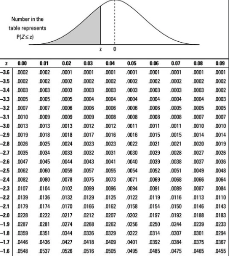

# Continuous Distributions
* Continuous Random Variables
* Uniform Continuous
* Exponential
* Normal


<br><br><br><br><br><br><br><br>

--------------------------------------
# Continuous Random Variables
* Methods for determining expected values typically depend on the application of calculus (integration)
* Probabilities of continuous random variables are represented by Probability Density Functions (PDF) 


<br><br><br><br><br><br><br><br>

----------------------------------------
# PDF vs PMF
* A PMF is able to produce probabilities for distinct values in the range
* A PDF does not give probabilities for distinct values, it produces probabilities over a given interval.


<br><br><br><br><br><br><br><br>

----------------------------------------
# Zero probability
In a continuous distribution, the probability of a single, exact outcome will be 0

Instead, we search for the probability within a range

$$
P(a \le x \le b)
$$

<br><br><br><br><br><br><br><br>

----------------------------------------
# Area under the Curve
The probability of a range of outcomes can be represented as the area under the curve for the plot of a probabilistic function.
* recall: $P(A) = \frac{|A|}{|S|}$

Can perform **integration** for integrable functions

Can apply Riehmann Sums approach for non-integrable functions


<br><br><br><br><br><br><br><br>

----------------------------------------
# Continuous Distributions
##### Uniform Continuous Distribution
Between some range, all values have equal probability

##### Exponential Distribution
Related to the Poisson distribution; where the Poisson distribution models “events per time (or area),” the exponential measure time (or space) in between events. Commonly used to model waiting times	

##### Normal Distribution
Normally distributed random variables have the iconic “bell-shaped” curve. 


<br><br><br><br><br><br><br><br>

----------------------------------------
# Uniform Continuous
Consider a uniform continuous distribution between $0$ and $1$. 

The probability of drawing a random value less than $0.43$ can be expressed as

$$
P(x \lt 0.43) = \frac{0.43 - 0}{1.0 - 0.0}
$$

$$
P(x \lt 0.43) = 0.43
$$

NOTE: due to the infinite precision of a continuous distribution, $\lt$ and $\le$ are equivalent above.


<br><br><br><br><br><br><br><br>

----------------------------------------
# Uniform Params

##### Expected Value

$$
E = \frac{1}{2}(\text{low bound} + \text{high bound})
$$

##### Variance

$$
\sigma^2 = \frac{1}{12}(\text{high bound} - \text{low bound})^2
$$

<br><br><br><br><br><br><br><br>

----------------------------------------
## Constructing a Uniform Continuous Distribution
Applying geometric decay to a binomial process

```python
from random import choice

def get_bit():
    return choice([0,1])


def get_binary(n=8):
    return [get_bit() for _ in range(n)]

    # return_list = []

    # for _ in range(n):
    #     return_list.append(get_bit())

    # return return_list

# print(get_binary(16))

def get_float(n=8):
    bin_list = get_binary(n)

    float_accum = 0.0

    for idx, bit in enumerate(bin_list, 1):
        float_accum += bit * 0.5**idx

    return float_accum, bin_list


print(get_float(8))
```


<br><br><br><br><br><br><br><br>

----------------------------------------
# Exponential Distribution
Where the Poisson distribution models “events per time (or area),” exponential measures time (or space) between Poisson events. 
* The most common application is to model waiting times	
    * The time necessary to wait for a cab
    * The time waiting to see the next shooting star while stargazing
    * Waiting time for the next customer to arrive at a store

----------------------------------------
# BREAKOUT (5 Minutes)
##### Code these 5 Exponential Functions

|                                                                      | |                         |
|----------------------------------------------------------------------|-|-------------------------|
|**Exponential ($\lambda$) PDF**                                       | |**Exponential Mean**      |
|`exponential_pdf(lmbda, x):`                                          | |`exponential_mean(lmbda):`|
|$f(x) = \lambda e^{-\lambda x} \text{ for } x \ge 0, \text{ else } 0$ | |<center>$E(X) = \frac{1}{\lambda}$</center>|

|                                                                 | |                              |
|-----------------------------------------------------------------|-|-----------------------------|
|**Exponential ($\lambda$) CDF**                                  | |**Exponential Variance**      |
|`exponential_cdf(lmbda, x):`                                     | |`exponential_variance(lmbda):`|
|$f(x) = 1 - e^{-\lambda x} \text{ for } x \ge 0, \text{ else } 0$| |<center>$E(X) = \frac{1}{\lambda^2}$</center>|

Also code `exponential_std(lmbda)`


<br><br><br><br><br><br><br><br>

----------------------------------------
# BREAKOUT Solution

```python
from math import e, sqrt

def exponential_pdf(lmbda, x):
    if x < 0: return 0
    return lmbda * e**(-lmbda * x)


def exponential_cdf(lmbda, x):
    if x < 0: return 0
    return 1 - e**(-lmbda * x)


def exponential_mean(lmbda):
    return 1 / lmbda


def exponential_variance(lmbda):
    return 1 / lmbda**2


def exponential_std(lmbda):
    return sqrt(exponential_variance(lmbda))
```


<br><br><br><br><br><br><br><br>

----------------------------------------
# Breakout (3 Minutes)

Suppose you’re on a street corner trying to hail a taxi cab. Let 

X = The amount of time (in minutes) that you have to wait. 
X ~ exponential(0.1)
ƛ = 0.1 (meaning the rate of cab arrivals is 0.1 per minute)

##### What’s the probability that you’ll have to wait more than ten minutes? 

##### What is the amount of time that you would expect to wait? 

##### What is the variance of this random variable?


<br><br><br><br><br><br><br><br>

----------------------------------------
# Breakout Solution

Suppose you’re on a street corner trying to hail a taxi cab. Let 

X = The amount of time (in minutes) that you have to wait. 
X ~ exponential(0.1)
ƛ = 0.1 (meaning the rate of cab arrivals is 0.1 per minute)

##### What’s the probability that you’ll have to wait more than ten minutes? 

```python
print(1 - exponential_cdf(lmbda=0.1, x=10))
```

##### What is the amount of time that you would expect to wait? 

```python
print(exponential_mean(lmbda=0.1))
```


##### What is the variance of this random variable?

```python
print(exponential_variance(0.1))
print(exponential_std(0.1))
```


<br><br><br><br><br><br><br><br>

----------------------------------------
# Normal Distribution
The classic "Bell-Shaped Curve"

Applies to many measured phenomena, to the Central Limit Theorem (CLT), to Confidence Intervals, used in Statistical Inference, and more.


<br><br><br><br><br><br><br><br>

----------------------------------------
# BREAKOUT (3 minutes)
#### Code the Normal PDF: `normal_pdf(x=0, mu=0, sigma=1)`
Given the mean, $\mu$
and standard deviation, $\sigma$

$$
f(x, \mu, \sigma) = \frac{1}{\sigma \sqrt{2\pi}}e^{-\frac{1}{2}(\frac{x-\mu}{\sigma})^2}
$$

```python
print(normal_pdf(0.5, 0, 1)) # --> ~0.3521
```


<br><br><br><br><br><br><br><br>

----------------------------------------
# BREAKOUT Solution
#### Code the Normal PDF: `normal_pdf(x=0, mu=0, sigma=1)`
Given the mean, $\mu$
and standard deviation, $\sigma$

$$
f(x, \mu, \sigma) = \frac{1}{\sigma \sqrt{2\pi}}e^{-\frac{1}{2}(\frac{x-\mu}{\sigma})^2}
$$

```python
from math import e, pi, sqrt

def normal_pdf(x=0, mu=0, sigma=1):
    return (1 / (sigma * sqrt(2 * pi))) * e **(-(1/2) * ((x - mu)/sigma)**2)

print(normal_pdf(0.5, 0, 1)) # --> ~0.3521
```


<br><br><br><br><br><br><br><br>

----------------------------------------
# Normal CDF
Typically to derive the CDF from a PDF, we would take the integral of the PDF. However, mathematicians do not have an effective set of techniques for taking the integral of such a complicated equation.

Statisticians and probabilists use tables, packages (for programming languages) and/or software to make accurate estimations for the CDF of a normal distribution. 


<br><br><br><br><br><br><br><br>

----------------------------------------
# Reading a Normal Table

Given a **z-score**, representing the number of standard deviations a value is away from the mean, reference a normal table to find the probability




<br><br><br><br><br><br><br><br>

----------------------------------------
# Calculate the Z-Score
To apply the Normal Z table, the distribution must be “normalized” to a normal distribution with $\mu = 0$, $\sigma = 1$


If $X \sim N(\mu, \sigma)$, we can define a new random variable $Z$ by

$$
Z = \frac{X-\mu}{\sigma}
$$

and 

$$
Z \sim N(0, 1)
$$

With the Z-score, we can reference a table for 

<br><br><br><br><br><br><br><br>

----------------------------------------
# Z-Score, Normal table Example Walkthrough

Scores on the verbal Scholastic Aptitude Test (SAT) follow a normal distribution with a **mean of 475**, and a **standard deviation of 98**.


1. First, find the z-score for the probability that a randomly chosen SAT score will be less than 300.

$$
P(X \le 300) = P \Bigl(\frac{X-\mu}{\sigma} \le \frac{300-\mu}{\sigma} \Bigr)
$$

$$
= P \Bigl(Z \le \frac{300-475}{98} \Bigr)
$$

2. From here we reference the table

$$
= \phi (-1.79) = 0.0367
$$

3. We can conclude that there is only a 3.67% chance that 
a randomly chosen SAT verbal score will be less 
than or equal to 300


<br><br><br><br><br><br><br><br>

----------------------------------------
# Let's code a CDF function
It has become more common to utilize functions from `scipy.stats`. We'll code a CDF function from scratch, though, using a Riehman's Sum approach on the PDF.

```python
def normal_cdf(x=0, mu=0, sigma=1):
    vals = [num*0.001 for num in range(-1000, int(x*1000))]

    area_accum = 0.0

    for val in vals:
        res = normal_pdf(val, mu, sigma)
        area_accum += res

        if val > x:
            break
    
    return area_accum*0.001

print(normal_cdf(x=300, mu=475, sigma=98)) # --> ~ 0.0371
```


<br><br><br><br><br><br><br><br>

----------------------------------------
# 