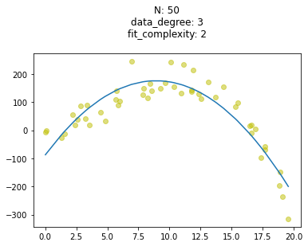
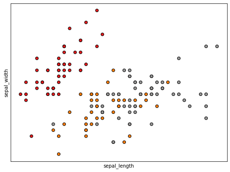
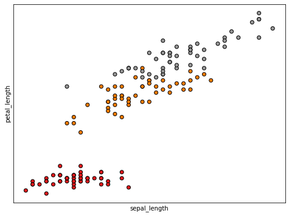
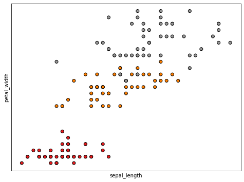
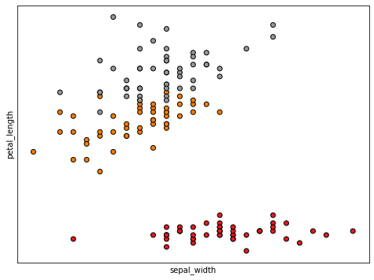
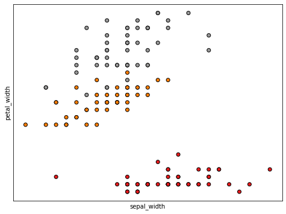
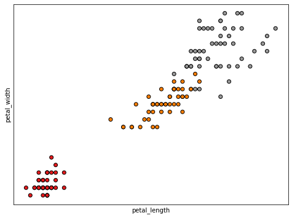
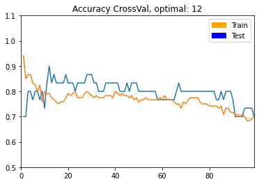

# Intro to Machine Learning, and more
* Markdown and Notetaking
* Jupyter notebooks
* Machine Learning
    * Cross-Validation Intuition
* ML Workflow


<br><br><br><br><br><br><br>

----------------------------------------------------

# Markdown
* a document formatting approach that makes writing documentation (or anything) really easy
* can do markdown outside of jupyter
    * filename: `something.md`
* you can make code cells

```python
def example(x):
    return f'I am {x}'
```


<br><br><br><br><br><br><br>

----------------------------------------------------
#  Jupyter Notebooks
* Have both code cells and markdown cells
* Has support to run in VSCode
* Can use [Google Colabs](https://colab.research.google.com/) to run code and allocate GPU resources for Deep Learning


<br><br><br><br><br><br><br>

----------------------------------------------------
# A Basis for Machine Learning
In consideration of methods to recognize patterns, Machine Learning can be thought of as the means by which an algorithm can discern an applicable function (out of infinitely many applicable functions) that can be applied to a given problem
* Some think of this as "writing code that discerns procedures" as opposed to the classic coding paradigm of "coding procedures" 
* A discerned, applicable function need not be the best
    * It must meet an arbitrary performance threshold


<br><br><br><br><br><br><br>

----------------------------------------------------
# Supervised vs Unsupervised Models
**Question**: Do you have a target variable in your data?
**if yes**: will likely use a **Supervised Model** to make target predictions on new data
**if no**: will likely use an **Unsupervised Model** to discern signal or categories within the data


<br><br><br><br><br><br><br>

----------------------------------------------------
# Supervised vs Unsupervised Examples

|Supervised|Unsupervised|
|----------|------------|
|Predicting MPG based on vehicle descriptors|Describing customers based on buying choices|
|Predicting customer churn based on prior churn data|Describing document topics based on word frequencies|
|Tagging images based on a prior tagged image data set|Grouping similar images together based on morphology|


<br><br><br><br><br><br><br>

----------------------------------------------------

# Machine Learning Issues
* How do you understand your machine learning **model** to be effective?


<br><br><br><br><br><br><br>

----------------------------------------------------
# Cross-Validation Basics
CrossVal provides sets of reasonable methods to discern the effectiveness of a trained machine learning model on **unseen data**

##### General CrossVal for Supervised Learning
1. Split Data into **training set**, **validation set**, and **test set**
2. Train model with various combinations of **hyperparameters**, 
* record prediction metrics on **validation set**
3. Choose optimal hyperparameters and train production model
* record prediction metrics on **test set**


<br><br><br><br><br><br><br>

----------------------------------------------------
# CrossVal Reasoning
Consider that you always want to validate the effectiveness of your model, whether it is Supervised or Unsupervised. 

Unsupervised validation often involves "putting eyes on it," although there are many unsupervised metrics as well.

There are more sophisticed forms of CrossValidation that involve more random splits, swapping out different models, etc

<br><br><br><br><br><br><br>

----------------------------------------------------
## Let's Suppress Warnings really quick
This just helps us have cleaner output for the code in the notebook

```python
import warnings
warnings.filterwarnings('ignore')
```

<br><br><br><br><br><br>

----------------------------------------------------
## Let's consider a scatterplot
* at differing levels of complexity
    * complexity can refer to the number of features in some data, width of a matrix, etc
    * here, we'll consider complexity as the order of a polynomial
    
$$
f(x) = ax^4 + bx^3 + cx^2 + dx + C
$$


```python
import numpy as np
import matplotlib.pyplot as plt

def plot_scatter_fit(num_samps=50, fit_complexity=1, degree=1):
    N = num_samps

    np.random.seed(seed=23)

    # gen rand x vals
    x = np.random.rand(N)*20
    

    # define polynomial
    if degree==1:
        y = 5*x + 3
    elif degree==2:
        y = 3*x**2 + 5*x + 3
    elif degree==3:
        y = -0.2*x**3 + 3*x**2 + 5*x + 3
    elif degree==4:
        y = 0.006*x**4 + -0.2*x**3 + 3*x**2 + 5*x + 3
    

#     # help us draw a fit line
#     fit = np.polyfit(x, y, 1)
#     fit_fn = np.poly1d(fit)
    
    
    # get scatter range
    y_val_range = np.ptp(y)
    
    
    # add gaussian/normal noise
    y = [pt + np.random.normal(loc=0.0, scale=((1./10)*y_val_range))
         for pt in y]
    
    
    # line that we draw
    fit_complexity_ = fit_complexity
    regr = np.poly1d(np.polyfit(x, y, fit_complexity_))(np.unique(x))
    
    
    # plot
    plt.title('N: {}\n'.format(N) + \
              'data_degree: {}\n'.format(degree) + \
              'fit_complexity: {}\n'.format(fit_complexity))
    
    plt.scatter(x, y, c='y', alpha=0.5)
    plt.plot(np.unique(x), regr)
    
    plt.show()


plot_scatter_fit(num_samps=50, fit_complexity=2, degree=3)
```





<br><br><br><br><br><br>

----------------------------------------------------
## Occam's Razor
* does a simpler model effectively explain the data/discover a signal in relation to a more complex model
    * should choose the simpler model that gets the job done effectively, meets the production performance threshold


<br><br><br><br><br><br>

----------------------------------------------------
# Applying CrossVal to a Classification Problem
* using the Iris Dataset
* Apply KNN, simple/naive algorithm
* We'll simplify CrossVal a little

<br><br><br><br><br><br>

----------------------------------------------------
## KNN (K-Nearest Neighbors
* KNN is supervised
    * **X** and y data
* KNN is non-parametric
    * potential to interpret non-linear data signals
* KNN training data IS ESSENTIALLY the fit model
    * must store dat/model in memory
    * prediction is computationally expensive
* KNN prediction is a majority vote between the k most similar instances on a yet unseen data point


<br><br><br><br><br><br>

----------------------------------------------------
## Basic Algorithm for  KNN

```
Given a structured data set:
    set value of k
    for each data point:
        find k most similar data points
        check class of each of k similar data points
        assume current data point is of the majority class checked
```


<br><br><br><br><br><br>

----------------------------------------------------
## Distance/Similarity metrics
* euclidean distance
* manhattan distance
* cosine similarity
* hamming distance/similarity


<br><br><br><br><br><br>

----------------------------------------------------
# General ML Workflow
## 1. Import/Clean/Reshape Data
* EDA (Exploratory Data Analysis)
    * most time consuming stage

**Note that you can run some *magic* commands in Jupyter**

```python
ls data
```

    iris.data.txt


```python
# load libraries
import pandas as pd

# define columns/features
names = ['sepal_length', 'sepal_width', 'petal_length', 'petal_width', 'class']

# load training data
df = pd.read_csv('data/iris.data.txt', header=None, names=names)

columns = df.columns


df.head(10)
```


<div>
<style scoped>
    .dataframe tbody tr th:only-of-type {
        vertical-align: middle;
    }

    .dataframe tbody tr th {
        vertical-align: top;
    }

    .dataframe thead th {
        text-align: right;
    }
</style>
<table border="1" class="dataframe">
  <thead>
    <tr style="text-align: right;">
      <th></th>
      <th>sepal_length</th>
      <th>sepal_width</th>
      <th>petal_length</th>
      <th>petal_width</th>
      <th>class</th>
    </tr>
  </thead>
  <tbody>
    <tr>
      <th>0</th>
      <td>5.1</td>
      <td>3.5</td>
      <td>1.4</td>
      <td>0.2</td>
      <td>Iris-setosa</td>
    </tr>
    <tr>
      <th>1</th>
      <td>4.9</td>
      <td>3.0</td>
      <td>1.4</td>
      <td>0.2</td>
      <td>Iris-setosa</td>
    </tr>
    <tr>
      <th>2</th>
      <td>4.7</td>
      <td>3.2</td>
      <td>1.3</td>
      <td>0.2</td>
      <td>Iris-setosa</td>
    </tr>
    <tr>
      <th>3</th>
      <td>4.6</td>
      <td>3.1</td>
      <td>1.5</td>
      <td>0.2</td>
      <td>Iris-setosa</td>
    </tr>
    <tr>
      <th>4</th>
      <td>5.0</td>
      <td>3.6</td>
      <td>1.4</td>
      <td>0.2</td>
      <td>Iris-setosa</td>
    </tr>
    <tr>
      <th>5</th>
      <td>5.4</td>
      <td>3.9</td>
      <td>1.7</td>
      <td>0.4</td>
      <td>Iris-setosa</td>
    </tr>
    <tr>
      <th>6</th>
      <td>4.6</td>
      <td>3.4</td>
      <td>1.4</td>
      <td>0.3</td>
      <td>Iris-setosa</td>
    </tr>
    <tr>
      <th>7</th>
      <td>5.0</td>
      <td>3.4</td>
      <td>1.5</td>
      <td>0.2</td>
      <td>Iris-setosa</td>
    </tr>
    <tr>
      <th>8</th>
      <td>4.4</td>
      <td>2.9</td>
      <td>1.4</td>
      <td>0.2</td>
      <td>Iris-setosa</td>
    </tr>
    <tr>
      <th>9</th>
      <td>4.9</td>
      <td>3.1</td>
      <td>1.5</td>
      <td>0.1</td>
      <td>Iris-setosa</td>
    </tr>
  </tbody>
</table>
</div>


```python
# What are the class names?
df['class'].unique()
```


    array(['Iris-setosa', 'Iris-versicolor', 'Iris-virginica'], dtype=object)


```python
len(df)
```


    150


**Can also treat a dataframe as an iterable, but this is best avoided**
```python
break_at = 10
for row in df['sepal_width']:
    print(row)
    break_at -= 1
    if break_at <= 0: break
```

    3.5
    3.0
    3.2
    3.1
    3.6
    3.9
    3.4
    3.4
    2.9
    3.1


<br><br><br><br><br><br>

----------------------------------------------------
## Plot Data

```python
X = df[['sepal_length', 'sepal_width', 'petal_length', 'petal_width']]
y = df[['class']]
```


```python
from sklearn.preprocessing import LabelEncoder

def plot_features(X_df, y_df, columns):
    le = LabelEncoder()
    y = le.fit_transform(y_df)
    
    # every pair of features
    built_pairs = []
    for col1 in columns[:-1]:
        for col2 in columns[:-1]:
            if col1 != col2 and (col1, col2) not in built_pairs and (col2, col1) not in built_pairs:
                tup = (col1, col2)
                built_pairs.append(tup)
                
    for pair in built_pairs:
        x_lab = pair[0]
        y_lab = pair[1]
        
        X = X_df[[x_lab, y_lab]].values
        
        x_min, x_max = X[:, 0].min() - 0.5, X[:, 0].max() + 0.5
        y_min, y_max = X[:, 1].min() - 0.5, X[:, 1].max() + 0.5
        
        # built plot
        plt.figure(2, figsize=(8,6))
        plt.clf()
        
        plt.scatter(X[:, 0], X[:, 1], c=y, cmap=plt.cm.Set1, edgecolor='k')
        plt.xlabel(x_lab)
        plt.ylabel(y_lab)
        
        plt.xticks(())
        plt.yticks(())
        
        plt.show()
        
plot_features(X, y, columns)
```




















<br><br><br><br><br><br>
------------------------------------------------
### Quick Note: using least optimal features
> In general, you would utilize the most optimal features from your data. In this case, we would get perfect prediction with KNN, so we're using the least optimal instead.


<br><br><br><br><br><br>
------------------------------------------------
## 2. Train/Test Split


```python
import numpy as np
from sklearn.model_selection import train_test_split
from sklearn.metrics import accuracy_score
from sklearn.neighbors import KNeighborsClassifier
from sklearn.linear_model import LogisticRegression
```


```python
# least separable features
X = np.array(df[['sepal_length', 'sepal_width']])
y = np.array(df[['class']])

# split into train and test sets
X_train, X_test, y_train, y_test = train_test_split(X, y, test_size=0.2, random_state=15)
```


<br><br><br><br><br><br>
------------------------------------------------
## 3. Search for hyperparameters
* hyperparams: inputs to the model that we can tune to make the model work better on the data
* this is where we do cross validation


```python
# hold accuracy scores for vals of k neighbors
neighbors = list(range(1, 100))
cv_train_scores = []
cv_test_scores = []

for k in neighbors:
    knn = KNeighborsClassifier(n_neighbors=k, p=1)
    
    # fit the model
    knn.fit(X_train, y_train)
    
    # get preds on train
    y_train_pred = knn.predict(X_train)
    cv_train_scores.append(accuracy_score(y_train, y_train_pred))

    # get preds on test
    y_test_pred = knn.predict(X_test)
    cv_test_scores.append(accuracy_score(y_test, y_test_pred))
```


```python
cv_train_scores;
```


```python
cv_test_scores;
```


<br><br><br><br><br><br>
------------------------------------------------
## Plot Results


```python
import matplotlib.patches as mpatches

test_max = cv_test_scores.index(max(cv_test_scores[::-1]))
opt_k = neighbors[test_max]

axes = plt.gca()
axes.set_xlim([0, len(neighbors)])
axes.set_ylim([min(cv_test_scores) -0.2, 1.1])

orange_patch = mpatches.Patch(color='orange', label='Train')
blue_patch = mpatches.Patch(color='blue', label='Test')
plt.legend(handles=[orange_patch, blue_patch])

title = f'Accuracy CrossVal, optimal: {opt_k}'

axes.plot(neighbors, cv_test_scores, label='test scores')
axes.plot(neighbors, cv_train_scores, label='train scores')

plt.title(title);

```





<br><br><br><br><br><br>
------------------------------------------------
## 4. Model Fit
* use optimal hyperparams
* for production or production testing


```python
# instantiate the learning model
knn = KNeighborsClassifier(n_neighbors=opt_k, p=1)

# fit model
knn.fit(X_train, y_train)
```


    KNeighborsClassifier(n_neighbors=12, p=1)


<br><br><br><br><br><br>
------------------------------------------------
## 5. Model Predict
* pass in hold out set (test)


```python
y_train_pred = knn.predict(X_train)
y_test_pred = knn.predict(X_test)
```


<br><br><br><br><br><br>
------------------------------------------------
## 6. Report Final Metrics


```python
print(f'Test Accuracy: {round(accuracy_score(y_test, y_test_pred), 3)}')
```

    Test Accuracy: 0.9


<br><br><br><br><br><br>
------------------------------------------------
# Swap in your own Model or Data
* Try replacing KNN with Logistic Regression or another model predicting a categorical outcome
* Try swapping out for a different dataset

The process described above is a little simplified, but it is the general framework applied to Supervised problems. 