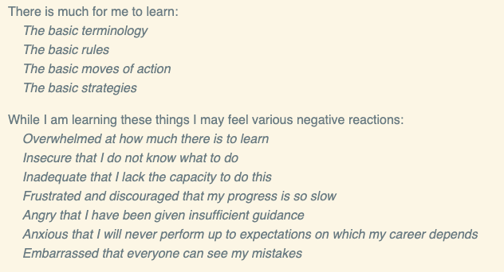
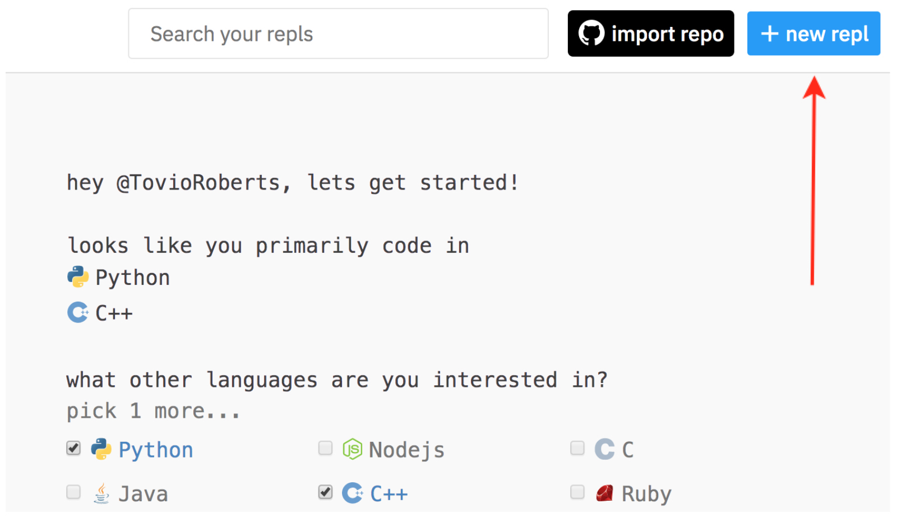
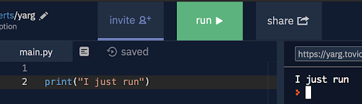

------------------------------------------------------
# Day 1
------------------------------------------------------


# Welcome to DSI Premium Prep
Instructors: Tovio Roberts/Clark Walker


Overview
Prep Goals and TI Expectations
The Materials
Study Hall and Mentoring
Technical Interview
Mindset
Learn, Repl.it, Google Colabs
Slack Etiquette

--------------------------------------------------

# Overview

##### 5 Weeks 
> M - Th  :    6 pm - 8 pm PT
>  Sat       :  11 am - 1:00/1:30 pm PT 
* [Premium Prep Links](https://docs.google.com/document/d/e/2PACX-1vRt-zNyEcn2rmfQGVEQKURadfRaS4NN6f8AbMB95WmsH2PE9JpWAQku6i4YKKce9x1bhRDtXrXYWD9U/pub)
* [Zoom Meeting](https://zoom.us/j/98989113857?pwd=UUwzcXRsTDZwNjJEQTh2WlBNNldoQT09)
* DSI Prep Team
    * [Clark Walker](https://www.linkedin.com/in/clark-walker/) | Python Instructor | clark.walker@galvanize.com
    * [Tovio Roberts](https://www.linkedin.com/in/tovio-roberts/) | Stats Instructor | tovio.roberts@galvanize.com
    * Team Members: 
        * Tovio Roberts tovio.roberts@galvanize.com
        * Lance Barto | lance.barto@galvanize.com
        * Remi Arata | remi.arata@galvanize.com
        * Devon DeJohn | devon.dejohn@galvanize.com
        * Clark Walker | clark.walker@galvanize.com
        * David Coleman (team admin) | david.coleman@galvanize.com

----------------------------------------------------------------

# Lecture Etiquette
Having your camera on is preferred
Please set yourself to mute by default, and be conscious of your microphone generally
Please be appropriately dressed if your camera is on
Please limit questions to the lecture thread and/or to the specified time allocated by the instructor

----------------------------------------------------------------
# Prep Goals

__Get diverse students to a baseline skill level to pass the Technical Interview__
Prepping for the DSI can take 3 weeks to 9 months, depending on current skills
Premium Prep materials parallel Basic Prep
We monitor you closely to best advise you toward the Technical Interview
You should interview as soon as you’re ready!

----------------------------------------------------------------
# Expectations
* You should work toward completion of the challenges in the Learn materials
* Attend lecture, watch lecture recordings
    * If you notice we’re not recording, REMIND US
* Complete takeaway/HW challenges
* Ask questions in Slack when you’re stuck for 10 minutes or more
    * Address peer questions using Socratic method
* PRACTICE PRACTICE PRACTICE outside of lecture

----------------------------------------------------------------
# The Materials...
* Learn is our Learning Management System
    * [Premium Prep Cohort](https://learn-2.galvanize.com/cohorts/2303)
* Sections
    * [Initialize](https://learn-2.galvanize.com/content_link/github/gSchool/dsi-premium-prep-onboarding/onboarding.md)
    * [Welcome](https://learn-2.galvanize.com/content_link/github/gSchool/dsi-prep-module-init/00_purpose/00_ds_prep_welcome_overview.md)
    * [Intro to Python](https://learn-2.galvanize.com/content_link/github/gSchool/dsi-prep-module-introPython/00_Welcome_to_Python/00_course_overview.md)
    * [Intermediate Python](https://learn-2.galvanize.com/content_link/github/gSchool/dsi-prep-module-intermPython/00_Welcome_to_Intermediate_Python/00_course_overview.md)
    * [Intro to Stats](https://learn-2.galvanize.com/content_link/github/gSchool/dsi-prep-module-introStats/00_Intro/00_probstats_overview.md)

----------------------------------------------------------------
# The Materials
* Slide decks, linked from [Prep Links doc](https://docs.google.com/document/d/e/2PACX-1vRt-zNyEcn2rmfQGVEQKURadfRaS4NN6f8AbMB95WmsH2PE9JpWAQku6i4YKKce9x1bhRDtXrXYWD9U/pub)
* Supplemental Homework
* [GitHub Repository](https://github.com/clownfragment/prem_prep_jan19_2021)
* Quick challenges posted in Slack

----------------------------------------------------------------
# Bugs and Edits
* We do our best to catch any bugs and perform copy edits prior to release
* Please Direct Message @Tovio and @Lance on Slack if you find bugs or copy errors in:
    * The Learn materials (lessons and challenges)
    * Homeworks/Supplemental Materials

----------------------------------------------------------------
# Lecture Format
* 2 hrs M-TH, + Saturday
* We will not review hw in the lecture
* Cover a topic 5-15 minutes, breakout for 3-7 minutes, rinse and repeat
* Question breaks (timeboxed to ~5 minutes)
    * Post questions in Slack, 
        * Unanswered questions will be followed up or one-on-one
        * Post in Slack or Ask a mentor outside of lecture

----------------------------------------------------------------
# Study Hall
* Streamed on YouTube
* A place for you to ask questions
* Monday/Wednesday/Friday, ~3-5 Pacific time
    * cancellations due to scheduling will be posted in Slack
* We’ll announce in Slack when we go live, post questions in a thread there

----------------------------------------------------------------
# Mentoring
* Reach out to people on our team to set up mentoring
    * Tovio Roberts
    * Clark Walker
    * Lance Barto
    * Remi Arata
    * Devon DeJohn

----------------------------------------------------------------
# Deferring
* If you’re falling behind or struggling, you may defer to the next or another future Premium Prep cohort.

----------------------------------------------------------------
# Supplemental Materials
* Do the [Further Studies](https://learn-2.galvanize.com/content_link/github/gSchool/ds-precourse/units/00_pair_programming/00_overview.md) materials on Learn
    * These include most of the required PreCourse materials
* Reach out for more work if you complete the challenges on Learn
* Reach out after you pass the TI, for subject-specific resources or for materials geared toward your weaknesses
* Do reps using [CodeWars.com](http://www.codewars.com/r/xCbgXQ)

----------------------------------------------------------------
# Applying for the DSI
* Get the admissions process started ASAP
    * [https://admissions.galvanize.com/](https://admissions.galvanize.com/)
* Gains you access to an Enrollment Advisor who can answer all the questions that our team cannot

----------------------------------------------------------------
# Technical Interview
* See the [Expectations Unit](https://learn-2.galvanize.com/content_link/github/gSchool/dsi-prep-module-init/01_expectations/01_expected_for_TI.md)
* 45 minutes
* Uses Jupyter Notebooks
* To schedule, you’ll need to pass a coding challenge within the [admissions portal](https://admissions.galvanize.com/)
* Once your python and stats skills are proficient, the [Technical Interview YT playlist](https://www.youtube.com/playlist?list=PL5T50pwCrPUofHFV-PuAD6av4uEteuara), is a great resource for gauging readiness for the TI

----------------------------------------------------------------
# Facilitators not Gatekeepers
* Technical Interview:
    * Probability and Statistics Fundamentals
    * Python Exercises focusing on implementing mathematical concepts and using the built-in functions and data types
        * Requires fluency with Dictionaries
    * Problem Solving Skills - ability to adapt, and pick up new information quickly


----------------------------------------------------------------
# The Beginner’s Creed
* [https://brennan.io/beginner/](https://brennan.io/beginner/)


----------------------------------------------------------------
# Growth vs. Fixed Mindset
* https://fs.blog/2015/03/carol-dweck-mindset/
    Carol Dweck - coined the term, leader in the research

<table border="0">
 <tr>
    <td><b style="font-size:30px">Fixed Mindset</b></td>
    <td><b style="font-size:30px">Growth Mindset</b></td>
 </tr>
 <tr>
    <td>
        <ul>
            <li>Avoids Challenges (often for fear of failure)</li>
            <li>Gives up easily</li>
            <li>Sees effort as fruitless, futile, or worse</li>
            <li>Ignores useful/negative feedback, takes criticism personally</li>
            <li>Feels threatened by the success of others, or is overly competitive</li>
        </ul>
</td>
    <td>
        <ul>
            <li>Embraces Challenges as an opportunity for growth</li>
            <li>Persists in the face of setbacks, shows resolve</li>
            <li>Sees effort as a path to mastery, knows that nothing comes easy and worthwhile things take effort</li>
            <li>Learns from criticism, doesn’t take things personally</li>
            <li>Encourages others, and finds inspiration in their successes</li>
        </ul>
    </td>
 </tr>
</table>

----------------------------------------------------------------
# Thinking Critically
* Early in their education, many aspiring data scientists focus on learning all of the programming tools/languages, mathematics, technologies, etc . . . these are necessary tools, but what makes a great data scientist is:
    * The ability to think critically about a problem, and approach a solution with a scientific/evidence based approach
    * The ability to ask the right question. Asking the question that will lead to an answer which will provide insight to the business, science, or research project they’re working on. 
    * A great data scientist is obsessed with solving complex problems, and will use any tool necessary to come up with an acceptable solution; even when that means they need to make a new tool themselves.
    * Develop consciousness of your biases
        * [Wikipedia List of Cognitive Biases](https://en.wikipedia.org/wiki/List_of_cognitive_biases)

----------------------------------------------------------------
# Let’s look at Learn, Repl.it, and Google Colabs
* [Learn](http://learn-2.galvanize.com/) houses all your lessons and coding challenges
* [Repl.it](http://repl.it) is a coding environment you can use until you become comfortable with coding in your local environment
* [Google Colabs](https://colab.research.google.com) is a cloud-based environment that runs Jupyter notebooks.  You can use Colabs until you set up your local environment to run Jupyter notebooks

----------------------------------------------------------------
# Slack Etiquette
* If you are asking a question on Slack about a specific challenge on Learn, please paste in a link to that challenge, along with a well-formed question
    * Reply to your peers questions within threads in order to keep Slack clean
* During lecture, please keep your questions within the Questions thread on Slack
* Don’t give people the answers

----------------------------------------------------------------


----------------------------------------------------------------
# Introduction to Python
* What is Python?
* Interpreted vs. Compiled Languages
* Python Resources
* Text Editors
* How to Program 
* Comments
* Extra (depending on time)
    * Simple Operators in Python

----------------------------------------------------------------
# What is Python?
* Python is a general-purpose programming language that can be used to:
    * develop web apps and software
    * write scripts to automate operations within operating systems
    * operate robots and other technical machinery
    * … and more!

----------------------------------------------------------------
# Python for Data Science
* Python is one of many languages in Data Science and Machine Learning. It is by far the most popular.
* Python is easy to learn, read and write.
* There are extensive scientific computing libraries and published academic work that uses Python

----------------------------------------------------------------
# Start off using repl.it to run your code
* Create an account and open up a new Repl now!


----------------------------------------------------------------
# Python is an Interpreted Language
* Interpreted languages are translated into machine code and run at the same time, giving immediate output.
* In repl.it, you can just hit the “Play” button and see results

* Interpreted languages: Javascript, Ruby, LISP, many other

----------------------------------------------------------------
# Compiled Languages
* A compiled language requires that your code be translated into a more fundamental machine language before it is run. This leads to a workflow of:
    * Write/Edit Code
    * Compile Code
    * Run the compiled executable
* Compiled languages: C/C++, Java/Scala (sort of), Rust

----------------------------------------------------------------
# Python Documentation and Resources 
* [Python Documentation ](https://docs.python.org/3/)
* [Pep 8 Style Guide ](https://www.python.org/dev/peps/pep-0008/)
* Try using Google first, before asking peers or instructors , for example:

* Practice on [CodeWars.com](http://codewars.com)

----------------------------------------------------------------
# Text Editors 
* Text editors are used to write plain text (using [UTF-8](https://en.wikipedia.org/wiki/UTF-8) encoding)
* DSI and Galvanize courses use [VSCode](https://code.visualstudio.com/) primarily, please install it ASAP
* Install [Anaconda](https://www.anaconda.com/distribution/) for your operating system, giving you access to Jupyter notebooks


----------------------------------------------------------------
# How to Program 
* Think about the problem 
* Define what it means for the program to be working 
* Create a series of formal steps that lead to a repeatable operation

----------------------------------------------------------------
# Think about the problem 
* Broadly define what you are trying to do. 
* Does your problem have a specific outcome that you want to obtain?

----------------------------------------------------------------
# Define what it means for the program to be working 
* Prior to writing any code, understand what a solution or what success is in your program
    * Is it suppose to print something?
    * Are you creating a new variable?
    * Are you changing an existing variable?

----------------------------------------------------------------
# Create a series of steps for a repeatable operation
* Think about how to obtain your solution in small definable steps.
* If necessary, write “Pseudocode” that describes the general algorithm for what you are trying to accomplish
* Write code (as in, translate Pseudocode into Python)

----------------------------------------------------------------
# BREAKOUT (5 minutes)
### Write an algorithm for boiling a box of spaghetti
* Define the steps clearly and at an appropriate level for an extra-terrestrial with good human language skills, who has never cooked pasta before
* There is no single correct solution here

----------------------------------------------------------------
# BREAKOUT SOLUTION EXAMPLE (abbreviated)
1. Gather cooking implements and supplies
    a. Take Boiling Pot out of cupboard under the counter
    b. Take Box of Spaghetti out of cupboard next to refrigerator
    c. Take Salt from spice rack
    d. Take oil from shelf next to stove
2. Prepare water for boiling pasta
    a. Fill Boiling Pot with water from the tap
    b. Place Boiling Pot on stove burner
    c. Turn heat dial clockwise so that it is on high
    ...

----------------------------------------------------------------
# Comments

```python
# this is a single line comment
```

```python
'''
This
is a 
multi-line
comment
'''
```

----------------------------------------------------------------
# Reasons for using comments
* Send a message to someone reading your code	
* Exclude some code snippet from running 
* Provide function documentation 
* Leave TODO: statements in your code, for later development

----------------------------------------------------------------
# Basic Python Constructs
* Common Data Types 
* Simple Operators in Python
* Assignment Operators

----------------------------------------------------------------
# Common Data Types 

* A **data type** can be thought of as _a form in which a piece of data can exist_
    * Working with integers, floats, booleans


* the `type()` function will tell you the data type 
    * ex: `type(23)` will tell you that 23 is an integer


----------------------------------------------------------------
# Number Types: `int`, `float`, and `bool`
* Integers can be thought of as “whole numbers”
* Floats can be thought of as “decimal numbers”
* Ints and floats are encoded differently
    * `1.0 == 1` ?? ⇒ `True`
    * However, `type(1.0) == type(1)` ?? ⇒ `False`

----------------------------------------------------------------
# BREAKOUT (3 minutes):
* Use the `type()` function to discover the type of the number `74`.
* Describe simply what you did on the line above your code snippet

----------------------------------------------------------------
# BREAKOUT SOLUTION:

```python
# output to console the type of 74
print(type(74))
```

NOTE: In general, you will want to avoid writing comments that say what your code is doing, unless, at this stage, it is for your own benefit and study

----------------------------------------------------------------
# Simplest Operators in Python
* Basic Arithmetic Operators: 
    Addition: `+`
    Subtraction:  `-` 
    Multiplication:  `*`
    Division: `/`
* PEMDAS
    * Use parentheses `(3+5) / 7` to ensure the desired order of operations


----------------------------------------------------------------
# Duck Typing
* Python is a “duck typed” language
    * _"If it walks like a duck, and quacks like a duck, then it must be a duck."_
    * Effectively, this means that you can perform mathematical operations between similar types, such as ints and floats, because Python infers a general type for the operation.
        * For example, operations between ints and floats will result in float results
        * Division will result in a float


----------------------------------------------------------------
# BREAKOUT (5 minutes)
* Add 5 and 7.2, multiply the result by 6, divide that result by 3, then square the result

----------------------------------------------------------------
# BREAKOUT SOLUTION
* Add 5 and 7.2, multiply the result by 6, divide that result by 3, then square the result

```python
print((((5 + 7.2) * 6) / 3)**2)
```

----------------------------------------------------------------
# Homework
* Read through the [Welcome to Data Science](https://learn-2.galvanize.com/content_link/github/gSchool/dsi-prep-module-init/00_purpose/00_ds_prep_welcome_overview.md) Prep Section
* Read the first 3 units in [Introduction to Python](https://learn-2.galvanize.com/content_link/github/gSchool/dsi-prep-module-introPython/00_Welcome_to_Python/00_course_overview.md)
    * [Welcome to Python](https://learn-2.galvanize.com/content_link/github/gSchool/dsi-prep-module-introPython/00_Welcome_to_Python/00_course_overview.md)
    * [About Python Programming](https://learn-2.galvanize.com/content_link/github/gSchool/dsi-prep-module-introPython/01_About_Python_Programming/00_unit_overview.md)
    * Complete all the challenges in [Python Basics](https://learn-2.galvanize.com/content_link/github/gSchool/dsi-prep-module-introPython/02_Python_Basics/00_unit_overview.md)
* Install [VSCode](https://code.visualstudio.com/)
* Set up a GitHub account [http://github.com](http://github.com)
    * Share your github username
    * Follow [clownfragment](https://github.com/clownfragment/) and [clarkwalker](https://github.com/clarkwalker/)
* Set up a CodeWars account at [http://codewars.com](http://www.codewars.com/r/xCbgXQ) 


----------------------------------------------------------------
# Day 2

* Python Basics
    * Common Data Types 
    * Simple Operators in Python
    * Assignment Operators
* Scalar Data Types 
* Declaring Variables
    * Variable Naming Syntax
* Logic Operators	
* Control Flow
* Homework

----------------------------------------------------------------
# Numeric Data Types 
* A data type can be thought of as a form in which a piece of data can exist
    * `int`   :  whole numbers
    * `float` :  decimal numbers
    * `bool`  :  `True` or `False`
* The `type()` function will tell you the data type:

```python
print(type(34)) # --> <class 'int'>
print(type(72.935)) # --> <class 'float'>
print(type(True)) # --> <class 'bool'>
```

----------------------------------------------------------------
# Numeric Type Encoding
* `int` and `float` datatypes are encoded differently, but are able to share operators in Python. 
    * Notice the values are considered equivalent, while the type of each data is different:

```python
print(1.0 == 1) # --> True
print(type(1.0) == type(1)) # --> False
```

----------------------------------------------------------------
# Python is a “duck-typed” language
* _"If it walks like a duck, and quacks like a duck, then it must be a duck."_
* The data type is automatically inferred
* Gives ability to share operations between data type through type inference:

```python
print(type(1)) # --> <class 'int'>
print(type(1.3)) # --> <class 'float'>
print(type(1 == 1.0)) # --> True
print(type(1 == 1.9)) # --> False> 
```

----------------------------------------------------------------
# Simple Operators in Python
* Basic Arithmetic Operators: `+`, `-`, `*`, `/`
* Floor Division: `//`
* Modulo: `%`
* Order of Operations: PEMDAS
* Exponentiate: `**`
* Casting: `int(x)`, `float(x)`

----------------------------------------------------------------
# Basic Arithmetic Operators
The basic arithmetic operators are intuitive and follow basic PEMDAS (Parentheses, Exponents, Multiplication/Division, Addition/Subtraction)

```python
print(2**2)             # --> 4
print(2 * 2)            # --> 4
print(2 / 2)            # --> 1.0
print(2 + 2)            # --> 4
print(2 - 2)            # --> 0
print((2 + 2)**(3 - 2)) # --> 4
```

----------------------------------------------------------------
# BREAKOUT (2 minutes)
* print the result of multiplying by 7 the addition of 6 and 3
* print the product of 7 times 6, squared, with 23 subtracted from the result
* print the division of the result of 4 minus 2 times 2 into twenty

----------------------------------------------------------------
# BREAKOUT Solution:
* print the result of multiplying by 7 the addition of 6 and 3

```python
print(7 * (6 + 3)) # --> 63
```

* print the product of 7 times 6, squared, with 23 subtracted from the result

```python
print((7 * 6)**2 - 23)) # --> 1741
```

* print the division of the result of 4 minus 2 times 2 into twenty

```python
print((20 / (4 - 2 * 2)) # --> Will throw an error in this interpretation
# or
print((4 - 2) * (20 / 2)) # --> 20
```

----------------------------------------------------------------
# Floor Division
`//`
* Truncates anything after the decimal,
    * gives an int if both data types are int
* `x // y`: Returns the quotient of x divided by y

```python
print(20 // 4)     # --> 5
print(100 // 102)  # --> 0
print(27 // 3)     # --> 9
print(72.6 // 3.3) # --> 21.0
print(72 // 3.3)   # --> 21.0
print(72.6 // 3)   # --> 24.0
```

----------------------------------------------------------------
# Modulo
`%`
* Returns the remainder after dividing y into x
* Wildly helpful, as it turns out
    * can check even-ness or odd-ness using `num % 2`
    * can check divisibility

```python
if num % 2 == 0: print('num is even')
if num % 2 == 1: print('num is odd')
if num % 4 == 0: print('num is divisible by 4')

print(21 % 4) # --> 1
print(20 % 4) # --> 0
print(5 % 20) # --> 5
print(6 % 20) # --> 6
```

----------------------------------------------------------------
# Modulo with `float` values


----------------------------------------------------------------
----------------------------------------------------------------
----------------------------------------------------------------
----------------------------------------------------------------
----------------------------------------------------------------
----------------------------------------------------------------
----------------------------------------------------------------
----------------------------------------------------------------
----------------------------------------------------------------
----------------------------------------------------------------
----------------------------------------------------------------
----------------------------------------------------------------
----------------------------------------------------------------
----------------------------------------------------------------
----------------------------------------------------------------
----------------------------------------------------------------
----------------------------------------------------------------
----------------------------------------------------------------
----------------------------------------------------------------
----------------------------------------------------------------
----------------------------------------------------------------
----------------------------------------------------------------
----------------------------------------------------------------
----------------------------------------------------------------
----------------------------------------------------------------
----------------------------------------------------------------
----------------------------------------------------------------
----------------------------------------------------------------
----------------------------------------------------------------
----------------------------------------------------------------
----------------------------------------------------------------
----------------------------------------------------------------
----------------------------------------------------------------
----------------------------------------------------------------
----------------------------------------------------------------
----------------------------------------------------------------
----------------------------------------------------------------
----------------------------------------------------------------
----------------------------------------------------------------
----------------------------------------------------------------
----------------------------------------------------------------
----------------------------------------------------------------
----------------------------------------------------------------
----------------------------------------------------------------
----------------------------------------------------------------
----------------------------------------------------------------
----------------------------------------------------------------
----------------------------------------------------------------
----------------------------------------------------------------
----------------------------------------------------------------
----------------------------------------------------------------
----------------------------------------------------------------
----------------------------------------------------------------
----------------------------------------------------------------
----------------------------------------------------------------
----------------------------------------------------------------
----------------------------------------------------------------
----------------------------------------------------------------
----------------------------------------------------------------
----------------------------------------------------------------
----------------------------------------------------------------
----------------------------------------------------------------
----------------------------------------------------------------
----------------------------------------------------------------
----------------------------------------------------------------
----------------------------------------------------------------
----------------------------------------------------------------
----------------------------------------------------------------
----------------------------------------------------------------
----------------------------------------------------------------
----------------------------------------------------------------
----------------------------------------------------------------
----------------------------------------------------------------
----------------------------------------------------------------
----------------------------------------------------------------
----------------------------------------------------------------
----------------------------------------------------------------
----------------------------------------------------------------
----------------------------------------------------------------
----------------------------------------------------------------
----------------------------------------------------------------
----------------------------------------------------------------
----------------------------------------------------------------
----------------------------------------------------------------
----------------------------------------------------------------
----------------------------------------------------------------
----------------------------------------------------------------
----------------------------------------------------------------
----------------------------------------------------------------
----------------------------------------------------------------
----------------------------------------------------------------
----------------------------------------------------------------
----------------------------------------------------------------
----------------------------------------------------------------
----------------------------------------------------------------
----------------------------------------------------------------
----------------------------------------------------------------
----------------------------------------------------------------
----------------------------------------------------------------
----------------------------------------------------------------
----------------------------------------------------------------
----------------------------------------------------------------
----------------------------------------------------------------
----------------------------------------------------------------
----------------------------------------------------------------
----------------------------------------------------------------
----------------------------------------------------------------
----------------------------------------------------------------
----------------------------------------------------------------
----------------------------------------------------------------
----------------------------------------------------------------
----------------------------------------------------------------
----------------------------------------------------------------
----------------------------------------------------------------
----------------------------------------------------------------
----------------------------------------------------------------
----------------------------------------------------------------
----------------------------------------------------------------
----------------------------------------------------------------
----------------------------------------------------------------
----------------------------------------------------------------
----------------------------------------------------------------
----------------------------------------------------------------
----------------------------------------------------------------
----------------------------------------------------------------
----------------------------------------------------------------
----------------------------------------------------------------
----------------------------------------------------------------
----------------------------------------------------------------
----------------------------------------------------------------
----------------------------------------------------------------
----------------------------------------------------------------
----------------------------------------------------------------
----------------------------------------------------------------
----------------------------------------------------------------
----------------------------------------------------------------
----------------------------------------------------------------
----------------------------------------------------------------
----------------------------------------------------------------
----------------------------------------------------------------
----------------------------------------------------------------
----------------------------------------------------------------
----------------------------------------------------------------
----------------------------------------------------------------
----------------------------------------------------------------
----------------------------------------------------------------
----------------------------------------------------------------
----------------------------------------------------------------
----------------------------------------------------------------
----------------------------------------------------------------
----------------------------------------------------------------
----------------------------------------------------------------
----------------------------------------------------------------
----------------------------------------------------------------
----------------------------------------------------------------
----------------------------------------------------------------
----------------------------------------------------------------
----------------------------------------------------------------
----------------------------------------------------------------
----------------------------------------------------------------
----------------------------------------------------------------
----------------------------------------------------------------
----------------------------------------------------------------
----------------------------------------------------------------
----------------------------------------------------------------
----------------------------------------------------------------
----------------------------------------------------------------
----------------------------------------------------------------
----------------------------------------------------------------
----------------------------------------------------------------
----------------------------------------------------------------
----------------------------------------------------------------
----------------------------------------------------------------
----------------------------------------------------------------
----------------------------------------------------------------
----------------------------------------------------------------
----------------------------------------------------------------
----------------------------------------------------------------
----------------------------------------------------------------
----------------------------------------------------------------
----------------------------------------------------------------
----------------------------------------------------------------
----------------------------------------------------------------
----------------------------------------------------------------
----------------------------------------------------------------
----------------------------------------------------------------
----------------------------------------------------------------
----------------------------------------------------------------
----------------------------------------------------------------
----------------------------------------------------------------
----------------------------------------------------------------
----------------------------------------------------------------
----------------------------------------------------------------
----------------------------------------------------------------
----------------------------------------------------------------
----------------------------------------------------------------
----------------------------------------------------------------
----------------------------------------------------------------
----------------------------------------------------------------
----------------------------------------------------------------
----------------------------------------------------------------
----------------------------------------------------------------
----------------------------------------------------------------
----------------------------------------------------------------
----------------------------------------------------------------
----------------------------------------------------------------
----------------------------------------------------------------
----------------------------------------------------------------
----------------------------------------------------------------
----------------------------------------------------------------
----------------------------------------------------------------
----------------------------------------------------------------
----------------------------------------------------------------
----------------------------------------------------------------
----------------------------------------------------------------
----------------------------------------------------------------
----------------------------------------------------------------
----------------------------------------------------------------
----------------------------------------------------------------
----------------------------------------------------------------
----------------------------------------------------------------
----------------------------------------------------------------
----------------------------------------------------------------
----------------------------------------------------------------
----------------------------------------------------------------
----------------------------------------------------------------
----------------------------------------------------------------
----------------------------------------------------------------
----------------------------------------------------------------
----------------------------------------------------------------
----------------------------------------------------------------
----------------------------------------------------------------
----------------------------------------------------------------
----------------------------------------------------------------
----------------------------------------------------------------
----------------------------------------------------------------
----------------------------------------------------------------
----------------------------------------------------------------
----------------------------------------------------------------
----------------------------------------------------------------
----------------------------------------------------------------
----------------------------------------------------------------
----------------------------------------------------------------
----------------------------------------------------------------
----------------------------------------------------------------
----------------------------------------------------------------
----------------------------------------------------------------
----------------------------------------------------------------
----------------------------------------------------------------
----------------------------------------------------------------
----------------------------------------------------------------
----------------------------------------------------------------
----------------------------------------------------------------
----------------------------------------------------------------
----------------------------------------------------------------
----------------------------------------------------------------
----------------------------------------------------------------
----------------------------------------------------------------
----------------------------------------------------------------
----------------------------------------------------------------
----------------------------------------------------------------
----------------------------------------------------------------
----------------------------------------------------------------
----------------------------------------------------------------
----------------------------------------------------------------
----------------------------------------------------------------
----------------------------------------------------------------
----------------------------------------------------------------
----------------------------------------------------------------
----------------------------------------------------------------
----------------------------------------------------------------
----------------------------------------------------------------
----------------------------------------------------------------
----------------------------------------------------------------
----------------------------------------------------------------
----------------------------------------------------------------
----------------------------------------------------------------
----------------------------------------------------------------
----------------------------------------------------------------
----------------------------------------------------------------
----------------------------------------------------------------
----------------------------------------------------------------
----------------------------------------------------------------
----------------------------------------------------------------
----------------------------------------------------------------
----------------------------------------------------------------
----------------------------------------------------------------
----------------------------------------------------------------
----------------------------------------------------------------
----------------------------------------------------------------
----------------------------------------------------------------
----------------------------------------------------------------
----------------------------------------------------------------
----------------------------------------------------------------
----------------------------------------------------------------
----------------------------------------------------------------
----------------------------------------------------------------
----------------------------------------------------------------
----------------------------------------------------------------
----------------------------------------------------------------
----------------------------------------------------------------
----------------------------------------------------------------
----------------------------------------------------------------
----------------------------------------------------------------
----------------------------------------------------------------
----------------------------------------------------------------